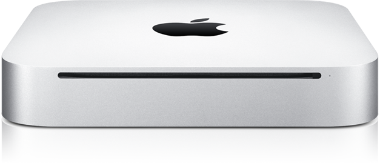

**[Mac mini الجديد: أجمل، أنحف و... أغلى](https://www.it-scoop.com/2010/06/apple-unveils-all-new-mac-mini/)**

كشفت Apple عن الـ Mac mini الجديد و الذي يأتي بتصميم أجمل، بسمك أنحف و –بطبيعة الحال- بثمن أغلى.

من مميزات النسخة الجديدة من Mac mini نجد كلا من:

-   معالج Core 2 duo بتردد 2.4 أو 2.66 GHz.

-   بطاقة رسومية Geforce 320M NVIDIA

-   ذاكرة تتراوح ما بين 2 إلى 8 Gb.

-   منفذي HDMI و FireWire

-   4منافذ USB.

أما من حيث الحجم فلقد عرفت Apple كيف تقلله حيث تأتي هذه النسخة من الـ Mac mini بتغذية كهربائية داخلية مما ينقص من الحجم الذي يحتاجه الجهاز إضافة إلى سمك  لا يتجاوز 3.5 سم فقط مقابل 5.08 في النسخة السابقة.

هناك أمر يدعي للاستغراب في الـ Mac Mini الجديد و المتمثل في ازدواجية تسعيره، حيث تبلغ النسخة الأمريكية منه 699 دولار مقابل  799 يورو للنسخة الأوروبية (علما أن اليورو أغلى من الدولار و ليس العكس).

يمكن الإطلاع على البيان الصحفي المنشور بمناسبة إطلاق النسخة الجديدة من الـ Mac mini من [هنا](http://www.apple.com/pr/library/2010/06/15macmini.html)
