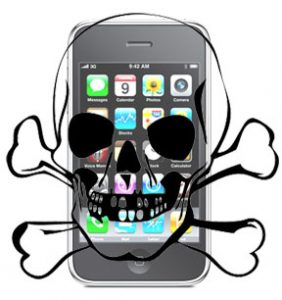

[**Sophos تطلق برنامجاً خاصاً بـ iPhone لمتابعة آخر المخاطر الأمنية**](https://www.it-scoop.com/2010/06/free-sophos-security-threat-monitor-iphone)

قامت شركة Sophos بإطلاق تطبيق لـ iPhone مصمم ليسمح للمستخدمين بالبقاء على إطلاع على آخر المخاطر، الأخبار والمعلومات حول البرمجيات الخبيثة.

يقوم التطبيق بتوفير نظرة على الجديد والقديم من مخاطر الحاسب الأمنية، ويتم تحديثه كل ساعة من خلال شبكة SophosLabs العالمية التي تضمن الكثير من الباحثين والمحللين.

سيكون بإمكان المستخدمين أن يشاهدوا آخر المخاطر في أي لحظة بالإضافة إلى معلومات حول الأنظمة والبرمجيات المعرضة للإصابة وكيفية تفادي الوقوع ضحية لهذه المخاطر.

يمكن تحميل التطبيق بشكل مجاني من خلال متجر iTunes للتطبيقات عبر اتباع [هذا الرابط](http://itunes.apple.com/gb/app/sophos-security-threat-monitor/id376343895?mt=8%E2%80%A9).
