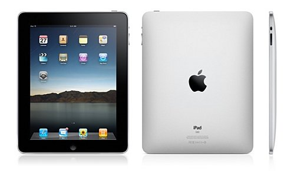

**[Apple تعلن عن بيع 3 ملايين iPad في 80 يوما فقط](https://www.it-scoop.com/2010/06/Apple-Sells-Three-Million-iPads-80-Days)**

أعلنت Apple اليوم عن تجاوز مبيعاتها من الجهاز اللوحي iPad سقف الـ 3 ملايين جهاز و هذا في ظرف 80 يوم فقط.

يأتي هذا الإعلان 22 يوما فقط بعد [إعلان Apple اجتياز مبيعات الـ iPad حاجز مليوني جهاز](https://www.it-scoop.com/2010/05/Apple-Sells-2-Million-iPads-Less-Than-60-Days) و هو ما يعني تمكنها من بيع ما 1.2 إلى 1.3 مليون جهاز iPad كل شهر.

كما اغتنمت Apple الفرصة لتشير إلى توفر 11 ألف تطبيق خاص بالجهاز اللوحي بعد أن كانت في حدود 500 تطبيق منذ 22 يوم.

يمكن الإطلاع على الإعلان الرسمي لتجاوز مبيعات جهاز iPad حاجز الـ 3 ملايين جهاز من [هنا](http://www.apple.com/pr/library/2010/06/22ipad.html)

- في رأيك: هل يرجع الأمر إلى حالة الفضول التي يمر بها عشاق منتجات Apple؟ أم أن الجهاز فعلا متميز لهذه الدرجة؟
