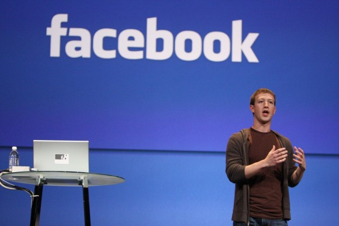

**[مليار دولار و مليار مستخدم ... قريبا على الـ Facebook](https://www.it-scoop.com/2010/06/Facebook-aiming-for-1-billion-users)**

في تصريح لـ Mark Zuckerberg المؤسس و المدير العام لـ Facebook بمناسبة Cannes Lions International Advertising فإن Facebook قد سطرت لنفسها هدفا قصير المدى و المتمثل في الوصول  إلى مليار مستخدم.

و  نقلت جريدة الـ Guardian البريطانية عنه فإن تحقيق ذلك قبل نهاية السنة الجارية أشبه بالمستحيل لكنه آت لا محالة.

كما أشار Zuckerberg إلى أن المفتاح إلى الوصول إلى ذلك هو استهداف الدول التي لا يلقى فيها Facebook رواجا كبيرا، أو أنه ليس الشبكة الاجتماعية الأكثر شهرة. و ضرب مثلا بروسيا و التي لا يتعدى مستخدمي Facebook فيها حاجز المليون. كما أن شبكته الاجتماعية ليست الأولى في شرق آسيا و أشار إلى كل من الصين، اليابان و كوريا الجنوبية. في حين تجاوز مستخدمو الـ Facebook عبر مختلف أنحاء العالم 400 مليون مستخدم.

على صعيد آخر فقط نقلت وكالة Reuters للأنباء مؤخرا أن مداخيل Facebook لهذا العام تجاوزت كل التوقعات حيث ناهزت الـ 800  مليون، و من المتوقع وصولها إلى حاجز المليار دولار قريبا.

يمكن قراءة خبر جريدة الـ Guardian  التي نقلت أقوال Zuckerberg  حول الأمر من [هنا](http://www.guardian.co.uk/media/2010/jun/23/mark-zuckerberg-facebook-cannes-lions)

- هل تظن أن Facebook قادرة على تحقيق المليارين في آن واحد على المدى القريب؟ و ما الذي يدفعه لاعتقاد ذلك؟
