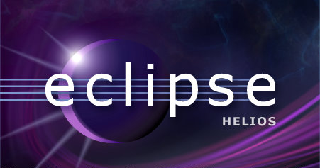

[**إطلاق الإصدار 3.6(Helios)  من الـ IDE متعدد اللغات و المنصات Eclipse**](https://www.it-scoop.com/2010/06/Eclipse-Helios-3-6-released)

أطلق القائمون على مشروع Eclipse الـ IDE الشهير متعدد اللغات و المنصات الإصدار 3.6 منه و الذي يحمل هذا العام اسم Helios بعد أن حمل اسم Galileo خلال الإصدار السابق.

ساهم في كتابة الإصدار 3.6 من Eclipse قرابة 490 مشترك منهم 100 مساهم مستقل و 44 شركة مختلفة و وصل طول شفرته إلى 33 مليون سطر برمجي.

لا يستعمل Eclipse لكتابة تطبيقات Java فحسب، بل يتعداه إلى غيره من لغات البرمجة كـ C/C++ و مختلف لغات الويب كالـ PHP و JavaScript و غيرهما.

أهم ما جاء في هذا الإصدار هو التسهيل من مهمة كتابة تطبيقات C/C++ لنظام Linux، و دعم نظام إدارة الإصدارات Git إلى جانب تحسين أدائه مع شفرات JavaScript بفضل مشروع JSDT.

يمكن تحميل الإصدار Helios من Eclipse و التعرف على قائمة المستجدات كاملة من [هنا](http://www.eclipse.org/helios/).

-هل استعملت Eclipse من قبل؟ و ما هي اللغات التي تفضل البرمجة بها باستعماله؟
