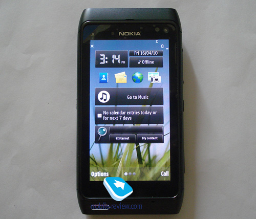

**[Nokia تطلب من السلطات الروسية التدخل لاسترجاع جهاز N8 المتسرب الموجود في حوزة مدون روسي](https://www.it-scoop.com/2010/07/nokia-n8-eldar-murtazin/)**

طالبت Nokia السلطات الروسية التدخل لاسترجاع نسخة أولية من جهاز N8 المتسرب و الموجود في حوزة المدون الروسي Eldar Murtazin رئيس تحرير موقع Mobile-review.com  و الذي قام بكتابة تقرير سلبي عن الجهاز منذ مدة.

تشير تدوينة Nokia التي تطالب فيها السلطات الروسية بالتدخل إلى أنها قد راسلت سابقا المدون المعني بالأمر لاسترجاع الجهاز لكنه رفض القيام بذلك. في حين نشر Murtazin [تغريدة](http://twitter.com/eldarmurtazin/status/17953106441) (انقر [هنا](http://translate.googleusercontent.com/translate_c?hl=en&ie=UTF-8&sl=ru&tl=en&u=http://twitter.com/eldarmurtazin/status/17953106441&prev=_t&rurl=translate.google.com&twu=1&usg=ALkJrhjbdwng4NB2C8IRQsX71NEi3Dj0FQ) لقراءة التغريدة مترجمة إلى الانجليزية) على حسابه على Twitter تفيد بأنه لم يتلقى أي طلب من Nokia** و أن تصريحها بإرسال رسالة إليه عبارة عن تصريح "كاذب".**

يمكن قراءة تدوينة Nokia حول القضية من [هنا](http://conversations.nokia.com/2010/07/07/legal-action-against-eldar-murtazin-official-statement/?utm_source=feedburner&utm_medium=feed&utm_campaign=Feed:+NokiaConversations-Posts+%28Nokia+Conversations+-+Posts%29).

-   هل تظن أن الأمر مجرد محاولة Nokia للحصول على حملة دعائية مجانية مثلما حدث لهاتف iPhone 4 بعد ضياعه و وقوعه في يد محرري مدونة gizmodo ؟
