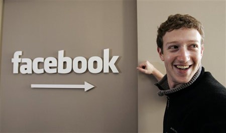

**[Facebook يتجاوز رسميا حاجز الـ 500 مليون مستخدم](https://www.it-scoop.com/2010/07/facebook-500-million-2/)**

أعلن Mark Zuckerberg  على مدونة Facebook الرسمية وصول عدد مشتركي شبكته الاجتماعية إلى 500 مليون مستخدم، و هذا بعد أشهر قليلة فقط من تجاوز عتبة الـ 400 مليون مستخدم.

و قد [صرحت](https://www.it-scoop.com/2010/07/facebook-will-announce-500-million-users-this-week/) Randi Zuckerberg سابقا لـ All Things Digital أن عدد المشتركين يصل إلى 500 مليون خلال هذا الأسبوع، و هو العدد الذي وصلنا إليه اليوم.

للتذكير فقد خصصت إدارة Facebook صفحة يمكن من خلالها تشارك بعض قصص المشتركين و التي لعب Facebook فيها دورا مهما، و التي يمكن الوصول إليها من هنا [Facebook Stories](http://stories.facebook.com/).

من المنتظر أن يطل Zuckerberg  على شاشة  ABC’s World News هذا المساء ليتم عقد لقاء معه بهذه المناسبة.

يمكن الإطلاع على الإعلان الرسمي عن وصول عدد مستخدمي Facebook  إلى 500 مليون من [هنا](http://blog.facebook.com/blog.php?post=409753352130)

- متى تتوقع أن تصل Facebook إلى مليار مستخدم؟
