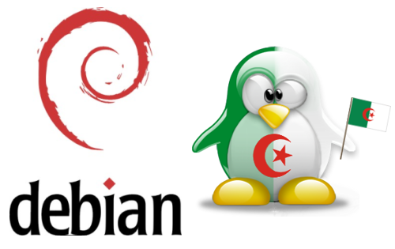

**[الجزائر تطلق أول mirror لها لتوزيعة Debian](it-scoop.com/2010/07/algeria-debian-mirror)**

أعلنت مجموعة طلابية تطلق على نفسها اسم [OpenMinds ](http://openmindsclub.org) إطلاق أول Mirror جزائري لتوزيعة Debian الشهيرة و الذي يعتبر أول Mirror على الساحة العربية لهذه التوزيعة و الثالث في العالم الإسلامي بعد كل من الخادمين الموجودين في تركيا و البوسنة.

المجموعة الطلابية و التي تنشط في [جامعة هواري بومدين للعلوم و التكنولوجيا USTHB ](http://www.usthb.dz/) تسعى بخطوتها هذه التقدم خطوة إلى الأمام بعالم المصادر المفتوحة ، حيث ستسمح مثل هذه الخطوة لمستعملي توزيعة Debian في الجزائر بتحديث أنظمتهم بالاتصال مباشرة بخوادم  محلية، و هو ما سيقلل من الضغط على الشبكات العالمية، كما يسمح بترسيم وجود مجتمع جزائري مهتم بالمصادر المفتوحة عموما و بتوزيعات Linux خصوصا.

حسب الإعلان الرسمي للمجموعة الطلابية ستكون الخطوة القادمة توفير خادمMirror  آخر لتوزيعة Ubuntu.

يمكن الإطلاع على الإعلان الرسمي عن الـ Mirror من [هنا](http://openmindsclub.org/index.php/newsclubreader/items/le-premier-miroir-debian-en-algerie-a-lusthb.html)

أو يمكن الولوج إلى الـ Mirror من [هنا](http://debian.usthb.dz/).

-هل تظن أن مثل هذه الخطوة كفيل بتعزيز مكانة المصادر الحرة في العالم الإسلامي عموما  و في الجزائر خصوصا؟
