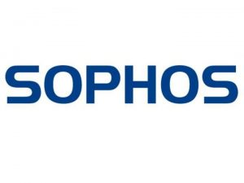

**[Sophos تطلق أداة مجانية للوقاية من الهجمات عبر ثغرة ملفات LNK لنظام Windows](https://www.it-scoop.com/2010/07/sophos-windows-shortcut-exploit-protection-tool)**

قامت شركة Sophos الأمنية بإطلاق أداة مجانية للوقاية من ثغرة نظام Windows الخاصة بملفات الاختصارات والتي أصابت العالم بالهلع!

ونظراً لكون الثغرة أصبحت مكشوفة للجميع لأكثر من أسبوع ولم تقم Microsoft سوى بالإعلان عن حل وقائي غير عملي ريثما يتم إصدار ترقيع رسمي - وهو تعطيل ملفات الاختصار الأمر الذي يؤدي إلى إظهار جميع الاختصارات على سطح المكتب وفي شريط المهام وقائمة ابدأ بصورة مزعجة وغير مرغوبة إطلاقاً- قامت Sophos بإطلاق هذه الأداة للوقاية من الثغرة.

تقوم الأداة باعتراض ملفات الاختصار التي تحوي على الاستغلال وتقوم بالتحذير من وجود محاولة تنفيذ شفرات برمجية خبيثة عبره. هذا يعني أنها ستقوم بإيقاف المخاطر نتيجة استغلال هذه الثغرة ونشرها عبر وسائط التخزين المحمولة مثل USB stick.

Graham Cluley، أحد كبار الاستشاريين التقنيين في شركة Sophos عقب يقول حول ما يحدث

<blockquote>لقد رأينا حتى الآن كل من دودتي Stuxnet و Dulkis بالإضافة إلى تروجان Chymin تقوم باستغلال هذه الثغرة في محاولة لمساعدتها على الانتشار أكثر فأكثر وإصابة المزيد من الأنظمة. Stuxnet تصدرت عناوين الصحف والأخبار لكونها تستهدف أنظمة SCADA الخاصة بـ Siemens وتبحث عن مخططات لمنشآت حساسة مثل معامل توليد الطاقة. التفاصيل الخاصة باستغلال هذه الثغرة أصبحت منشورة على الإنترنت، مما يعني بأنها أصبحت مثل لعبة الأطفال للقراصنة الآخرين ليقوموا باستغلالها وإنشاء هجمات جديدة.</blockquote>

يمكن تشغيل الأداة المجانية من Sophos إلى جانب إلى برنامج حماية من الفيروسات دون مشاكل وتضيف طبقة أخرى من الحماية لإيقاف الهجمات الخاصة بهذه الثغرة. على عكس حل Microsoft الوقائي الضعيف لا تقوم هذه الأداة بتشويه ظهور الأيقونات السليمة في نظامك – مما يعني أنك تستطيع متابعة عملك براحة أكبر كما من قبل دون الانزعاج من اختفاء صور أيقونات ملفات الاختصارات.

بالإمكان تحميل أداة "[Windows Shortcut Exploit Protection Tool](http://downloads.sophos.com/custom-tools/Sophos%20Windows%20Shortcut%20Exploit%20Protection%20Tool.msi)" من Sophos بالنقر على الرابط.

للإطلاع على تفاصيل أكثر حول الأداة واستخدامها مع فيديو يوضح عملها أثناء التعرض للإصابة يمكن مراجعة [الرابط التالي](http://www.sophos.com/products/free-tools/sophos-windows-shortcut-exploit-protection-tool.html).
