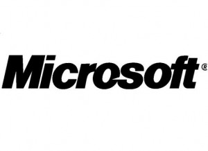

**[Microsoft: لا نخطط للدفع مقابل التبليغ عن الثغرات الأمنية حالياً](it-scoop.com/2010/07/microsoft-says-no-paying-bug-bounties)**

وفقاً لمدونة من قبل Dennis Fisher على موقع Threatpost فإن ناطقاً رسمياً باسم Microsoft نفى أي فكرة أن تكون Microsoft تخطط للبدء بالدفع مقابل الحصول على تفاصيل الثغرات الأمنية كما فعلت Mozilla و Google خصوصاً مؤخراً عندما قامت كل من الشركتين بزيادة مبالغ الجوائز المقدمة للثغرات الأمنية المبلغ عنها للشركة.

وفي حديث Jerry Bryant لـ Fisher يقول:

<blockquote>

> 
> نحن نقدر النظام الايكولوجي للباحثين، ونظهر تقديرنا بالعديد من الطرق، لكننا لا نعتقد بأن دفع جائزة لكل ثغرة هي أفضل طريقة لهذا. خصوصاً بأن الدوافع وسط مجتمع الباحثين ليست دوماً مالية. من المعروف جيداً بأننا نعترف بمساهمات الباحث ضمن نشراتنا الأمنية الدورية عندما يقوم الباحث بالتنسيق معنا بحيث يكون طرح تفاصيل الثغرة متزامن مع طرح الترقيع الأمني لها.
> 
> 

> 
> في حين أننا لا نقدم جائزة نقدية لكل ثغرة على حدة، كما تفعل باقي الشركات، فإننا نقدر ونعترف بالموهبة. لدينا العديد من الباحثين الأمنيين المهرة الذين انضموا إلى الفريق الأمني الخاص بنا كموظفين لدى شركة Microsoft. كما أننا قمنا بتوقيع عقود مباشرة مع العديد من الجهات وفي بعض الأحيان أفراد من الباحثين لاختبار منتجاتنا بحثاً عن الثغرات قبل طرحها. العديد من هذه الجهات والأفراد نتذكرهم بداية حديثنا لما قدموه من طرق فريدة وعالية المهارة في الثغرات الأمنية التي أبلغوا بها Microsoft Security Research Center (MSRC).
> 
> 
</blockquote>

يتوقع أن تقوم Microsoft بمناقشة هذا التحول الفلسفي مع الخبراء هذا العام في مؤتمر Black Hat الأمني.

للإطلاع على الخبر الأصلي يمكن مراجعة [الرابط التالي](http://threatpost.com/en_us/blogs/microsoft-says-no-paying-bug-bounties-072210).
