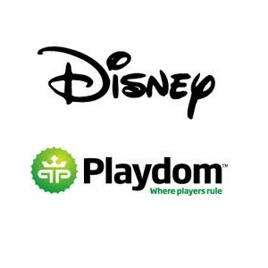

**[Walt Disney تقرر شراء Playdom المتخصصة في ألعاب الشبكات الاجتماعية](https://www.it-scoop.com/2010/07/walt-disney-to-acquire-playdom)**

قررت Walt Disney أن تهدي Mickey Mouse ماهو أكثر من مجرد لعبة واحدة فقط ، و إنما  شركة ألعاب كاملة متمثلةً في  Playdom المتخصصة في الألعاب على الشبكات الاجتماعية و المنافسة القوية لـ Zynga التي استثمرت فيها Google مؤخرا مبلغ 100 مليون دولار.

قررت Walt Disney تخصيص 563 مليون دولار لشراء  Playdom ، إضافة إلى 200 مليون ستكون من نصيب المساهمين في الشركة إذا ما حققت نتائج إيجابية بعد شرائها، و تعتبر عملية الشراء هذه الأضخم في مجالها.

تكمن أهمية شركة Playdom في كونها تحتل المرتبة الأولى في ألعاب شبكة  MySpace و الرابعة على Facebook، و تصبو Disney من وراء شرائها لـ Playdom  إلى "تغيير الطريقة التي يلعب فيها مستخدمو الإنترنت الألعاب المختلفة على الشبكات الاجتماعية"

تأتي عملية الشراء هذه بعيد عملية شراء شركة Tapulous المنتجة للألعاب لهواتف الـ iPhone، و هذا في ظل شراء Electronic Arts العام الماضي لشركة Playfish ذات الـ 60 مليون مشترك، و استثمار Google لـ 100 مليون في شركة Zynga، كما أن إشاعات إطلاق Google لشبكة اجتماعية مبنية على الألعاب  تتأكد يوما بعد يوم، مما يعكس أهمية هذا القطاع على الإنترنت.

يمكن الإطلاع على إعلان Disney نيتها في شراءها لـ  Playdom من [هنا](http://corporate.disney.go.com/news/corporate/2010/2010_0727_playdom.html)
