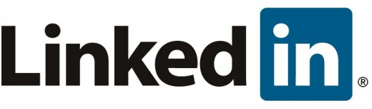

**[LinkedIn يسجل أولى عمليات توسعها بشراء mSpoke](https://www.it-scoop.com/2010/08/linkedin-acquires-mspoke)**

أعلنت أمس الشبكة الاجتماعية المهنية  LinkedIn عن أولى عمليات شرائها لشركات ناشئة أخرى و التي تخص شراء شركة mSpoke المتخصصة في تقنيات التوصيات recommendations.

تطور mSpoke تقنيات تتعلق بالتوصيات أو ما يعرف بالـ recommendations ، و التي تتيح الحصول على نتائج بحث أكثر دقة. مما يسمح لـ LinkedIn بتقديم أداة بحث أفضل للوظائف و الشركات و الأفراد و الأخبار التي تتعلق بهم.

LinkedIn تضم حاليا 75 مليون عضو من 200 دولة و من مختلف الشركات، و تسجل جميع شركات Fortune 500 حضورها عليها.

[البيان الصحفي الذي يعلن شراء  LinkedIn  لـ mSpoke](http://press.linkedin.com/mspoke-acquisition)
