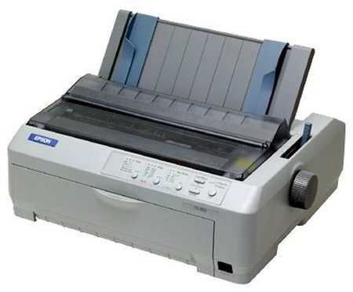

**[دراسة أمنية تكشف عن إمكانية سرقة البيانات بمجرد الاستماع إلى صوت الطابعة التي تطبعها](https://www.it-scoop.com/2010/08/acoustic-side-channel-attacks-on-printers)**

تلجأ عادة الشركات لتجنب سرقة ملفاتها إلى إتلافها و ذلك باستعمال آلات خاصة بذلك تقوم بتقطيع الأوراق، لكن هل سمعت من قبل عن إمكانية سرقة هذه البيانات قبل أن تخرج من الطابعة (أو تقريبا)، حيث كشف فريق أمني ألماني عن إمكانية سرقة البيانات بمجرد تحليل الصوت الصادر عن الطابعة التي تطبعها.

الطابعات المعنية بالأمر هي الطابعات النقطية فقط dot-matrix printer  المعروفة بإصدارها لأصوات لدى الطباعة، حيث عمد الباحثون الأمنيون إلى طباعة ملايين الكلمات الموجودة في القواميس و تسجيل الصوت الذي يصدر عن كل كلمة و إدخالها في قاعدة بيانات كبيرة.

كما تم استخدام خوارزميات التعرف على الصوت لتحسين أداء البرنامج.

وصلت نسبة النجاح في التعرف على محتوى المستندات المطبوعة إلى 72,5 %. و ارتفعت إلى غاية 95,2% لما يكون المجال الذي يعالجه المستند المستهدف معروفا.

يبقى استغلال هذه التقنية محدودا بسبب إلزامية أن يكون الميكروفون الذي يلتقط الصوت على مسافة لا تزيد عن 10 سنتمتر من الطابعة، لكن هذا لا يقلل من أهميتها نظرا للاستعمال الواسع للطابعات النقطية في العديد من المجالات الحساسة، حيث تصل نسبة استعمال هذه الطابعات إلى 30% في البنوك الألمانية، و ترتفع النسبة إلى 60% لدى الأطباء الألمان.

يمكن تحميل الدراسة التي تبين إمكانية التجسس على الطابعات النقطية من [هنا](http://people.csail.mit.edu/costan/readings/usenix_papers/Backes.pdf)، و التي سيتم   استعراض هذه النتائج خلال مؤتمر [Usenix Security](http://www.usenix.org/) الذي ستدوم فعالياته 3 أيام ابتداءً من يوم غد
