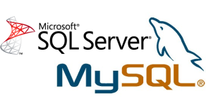

**[Microsoft تطرح MySQL Migration tool v1.0](https://www.it-scoop.com/2010/08/mysql-migration-tool-v1/)**

قامت Microsoft البارحة بنشر أول إصدار من الأداة المصممة للمستخدمين الذين يودّون الانتقال من قواعد بيانات MySQL إلى SQL Server و/أو SQL Azure و المسماة MySQL Migration tool.

تعد أداة MySQL Migration جزءاً من حزمة أدوات SQL Server Migration Assistant أو ما يعرف بـ SSMA.

[يتوفر الإصدار الأول للتحميل](http://www.microsoft.com/downloads/details.aspx?displaylang=en&FamilyID=69739c8c-ac82-41de-b9e6-8fa5ae2594d9) في مركز تحميل Microsoft. قامت Microsoft أيضاً بتحديث حزم الانتقال الأخرى الخاصة بـ Oracle, Sybase و Access في الوقت نفسه كجزء من الإصدار 4.2 البارحة.

و على الرغم من شراكة MySQL و Microsoft فإنهما يبقيان في إطار المتنافسين ومنذ أن قامت Oracle بشراء Sun (وامتلكت بذلك MySQL كجزء من العملية)، أخذت Microsoft بالتعامل مع MySQL بكونه أحد المنافسين أكثر من كونه شريكاً لها.

يتوافق SSMA for MySQL 1.0 مع إصدارات MySQL 1.4 فما فوق .

تسمح الأداة للمبرمجين بـ:

تحويل/دمج الجداول tables، views

، الإجراءات المخزنة stored procedures،

الوظائف المخزنة stored functions،

القوادح triggers،

المؤشرات cursors، DML statements،

control statements

والمناقلات transactions،

و هذا [وفقاً لمدونة نشرت على موقع فريق عمل SSMA](http://blogs.msdn.com/b/ssma/archive/2010/08/12/microsoft-announces-sql-server-migration-assistant-for-mysql.aspx).
