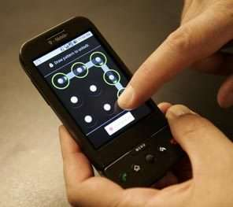

**[دراسة أمنية تكشف عن إمكانية اكتشاف كلمات سر الهواتف الذكية من آثار الأصابع المتروكة على شاشاتها](https://www.it-scoop.com/2010/08/smudge-attacks-on-smartphone-touch-screens)**

كشفت دراسة قام بها باحثون أمنيون أمريكيون عن أن الآثار التي تتركها الأصابع على شاشات الهواتف الذكية المجهزة بتقنية اللمس، قادرة على الكشف عن كلمة السر المستعملة.

الدراسة الأمنية و التي اقتصرت على جهازي HTC G1 و Nexus One المجهزين بنظام  Android  و على كلمة سر واحدة، حيث أنه قبل الإصدار 2.2  من نظام Android المسمى Froyo كانت حماية الهاتف تقتصر على الرسم بالأصابع شكلا معينا على شاشة الهاتف، و بما أن المناطق الأكثر استعمالا من الشاشة هي الأقل نظافة بسبب ما تتركه ترسبات اليدين عليها، حيث أن نسبة معرفة كلمة السر (أو رسم السر إن صح القول) وصلت إلى غاية 92% و هذا في ظروف مثالية، لكن هذه النسبة تنزل إلى 37% إذا لم تتوفر كامل شروط استرجاع كلمة السر.

تبقى أفضل وسيلة للحماية من مخاطر اكتشاف كلمات السر هي غسل اليدين قبل الأكل استعمال الهاتف و تغيير كلمة السر بشكل دوري.

يمكن تحميل الدراسة الأمنية من [هنا](http://www.usenix.org/events/woot10/tech/full_papers/Aviv.pdf)
