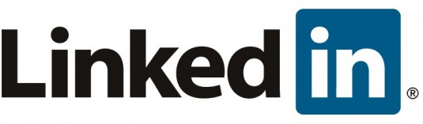
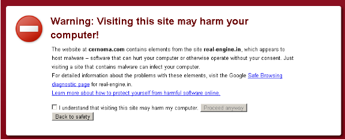

**[بريد مزوّر من LinkedIn قد يعرض جهازك للاختراق](https://www.it-scoop.com/2010/08/fake-linkedin-email/)**

نوع آخر من البريد المزعج والذي يزعم بأنه رسالة من صديقك في الجامعة بدأ في الظهور مؤخراً، حيث يقول Dan Tynan من ITworld بأنه تلقى أكثر من 20 رسالة متشابهة نوعاً ما من البريد المزعج خلال مدة 24 ساعة تصل بصورة دعوة عبر موقع LinkedIn، والتي تخطى معظمها عبر فلتر البريد المزعج حيث احتوى معظم هذا البريد المزعج على العبارة:

"[Insert name here] has indicated you are a Colleague at Interbrand"

عندما قام Dan بالسماح بعرض الصور المرفقة ظهرت له صورة دعائية لبعض المنشطات الجنسية.

جميع الروابط التي كانت في الرسالة  توصل إلى موقع يسمى PathTasty، والذي يقدم نفسه على أنه "Canadian Pharmacy -- #1 Internet Online Drugstore". بالبحث في Google تبين التالي من خلال تقرير معدّ من قبل [Mcafee Site Advisor](http://www.siteadvisor.com/sites/pathtasty.com/postid?p=5064232):

“Canadian Pharmacy” / “European Pharmacy” / “Canadian Healthcare” هي عبارة عن منظمات ناشطة دوائية خطيرة وغير قانونية مدارة من قبل بعض المجرمين الروس المعروفين باسم Igor Gusev, Andrey Smirnov وشركاؤهم في برنامج SpamIt/Glavmed.

تلقى Dan أيضاً المزيد من البريد المزعج والذي يوصل إلى مواقع بأسماء غريبة (مثل “Cernoma”). عندما قام Dan بزيارة الموقع، أظهر متصفح Google Chrome الذي يستخدمه التحذير التالي:

والذي يشير إلى أن الموقع يحتوي على شفرات خبيثة تحاول استغلال ثغرات تسمح بتنفيذ drive-by downloads attacks.

من الواضح أن الناس خلف هذه العمليات يحاولون استغلال ثقة الناس ببعض المواقع/الخدمات الاجتماعية المشهورة ليقوموا بفتح البريد الالكتروني الواصل إليهم، ومن هناك يأملون أن يقوم أحدهم بفتح تلك الروابط والتجول عبرها.

هذه ليست المرة الأولى التي تم فيها استغلال شهرة الشبكات والخدمات الاجتماعية بهدف نشر برمجيات خبيثة لدى الغافلين عما يدور خفية عنهم.

يمكن قراءة مزيد من التفاصيل حول الخبر من [هنا](http://www.pcworld.com/article/203301/warning_fake_linkedin_email_could_infect_your_pc.html?tk=hp_new)
