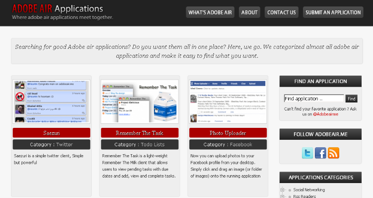

**[إطلاق دليل Adobe AIR Apps للوصول السريع لتطبيقات AIR  و معرفة تفاصيلها](https://www.it-scoop.com/2010/08/adobe-air-apps/)**

أطلق المبرمج المصري [حسام عادل](http://twitter.com/Hos4m) موقعا جديدا مهتما بالتطبيقات المكتوبة بـ Adobe AIR و الذي يعتبر دليلا للوصول السريع إليها و معرفة تفاصيلها.

الموقع الجديد يجنب المهتم بتطبيقات AIR عناء البحث عنها، حيث نجدها على الموقع مبوبة حسب مجال استخدامها (شبكات اجتماعية، التجارة الالكترونية، الوسائط المتعددة ...).

كما نجد مع كل تطبيق وصفا سريعا له، و جملة من التطبيقات المشابهة له، إلى جانب إمكانية التعليق على التطبيق، مما يعطي للموقع طابعا تفاعليا أكثر.

الموقع حاليا لا يوفر حاليا سوى واجهة انجليزية له لكنه من المنتظر إطلاق واجهات بلغات أخرى لاحقا.

لزبارة الموقع:

[Adobe Air Apps](http://adobeair.me/)
