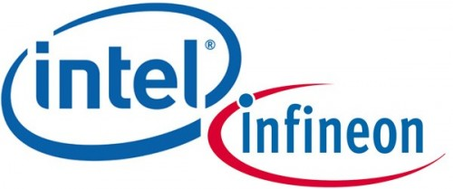

**[Intel تشتري فرع الـ wireless  الخاص بـ Infineon](https://www.it-scoop.com/2010/08/intel-infineon-wireless/)**

تواصل Inel عمليات شرائها الاستراتيجية فبعد شرائها غير المتوقع لـ McAfee بسعر 7.7 مليار دولار، قامت Intel بالتوصل إلى اتفاق لشراء فرع الـ wireless  الخاص بالمجمع الألماني لأنصاف النواقل Infineon مقابل 1.4 مليار دولار.

و قد أعلنت Intel في [البيان الصحفي](http://newsroom.intel.com/docs/DOC-1173) الذي نشرته للإعلان عن عملية الشراء أن فرع الـ wireless  الذي سيحظى باستقلالية، حيث يسمح له  بمواصلة نشاطه بطريقة عادية، و مواصلة توفير الدعم لزبائنه الحاليين .

من المرجح أن يكون من  أهم الأسباب التي دفعت Intel إلى شراء هذا الفرع هو رغبتها في الحصول على حصص إضافية من سوق الهواتف الذكية، حيث أنها و بالرغم من الحصة الكبيرة التي تحظى بها في سوق معالجات الحواسيب و الـ Netbooks، إلا أنها تبقى بعيدة عن كل من Qualcomm  و Texas Instruments اللتان تمتلكان الصدارة خاصة فيما يتعلق بالهواتف الذكية عالية الجودة.

قد تكون Intel تهدف من وراء عمليات الشراء هذه إلى الاستثمار في مجالات غير مجال تخصصها الرئيسي، حيث أن سوق المعالجات شهد ركودا قبل أن يعرف انطلاقة جديدة و هو ما جعل مصدر رزقها الأول في حالة من عدم الاستقرار.
