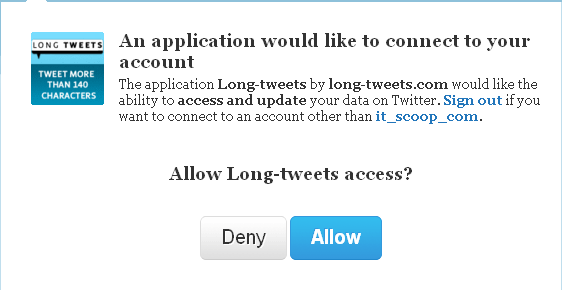

**[Twitter تفرض بوتوكول OAuth ابتداءً  من اليوم على التطبيقات التي تستخدم الـ API الخاصة بها](https://www.it-scoop.com/2010/08/twitter-oauth-protocol/)**

ابتداءً من اليوم فإنه لن يعود ممكنا لمبرمجي تطبيقات Twitter طلب اسم المستخدم و كلمة السر من المستخدمين ، فلقد فرضت Twitter استعمال بروتوكول OAuth على كل التطبيقات التي تود استغلال الـ API الخاصة بها.

الوضع الحالي من شأنه أن يوفر حماية أكبر للمستخدمين ، حيث أن التطبيقات ستطلب من المستخدم تسجيل دخوله إلى Twitter و موافقته على استخدام التطبيق بدل طلب اسم المستخدم/كلمة السر مثلما يظهر في الصورة التالية:

لضمان مرور سلس من النظام القديم إلى النظام الجديد الذي يعتمد على استخدام البروتوكول OAuth قامت Twitter بإعلام المطورين بالأمر منذ شهر ديسمبر الماضي ، و هو ما منح لهم وقتا كافيا للقيام بعمليات التغيير اللازمة.

و قد أعلنت Twitter [على التدوينة التي تخص هذا الحدث](http://blog.twitter.com/2010/08/twitter-applications-and-oauth.html) أن أغلب التطبيقات الشهيرة أمثال Echofon ، TweetDeck ، Twitterrific ، Seesmic ، و  Twitter لأنظمة  Android ، iPhone و  BlackBerry قد قامت بعمل بالتحويلات اللازمة.

إن واجهتك أية مشاكل مع التطبيق الذي اعتدت استعماله كل ما عليك فعله هو تنصيب أحدث إصدار منه و سيتم حل المشكل (إن كان التطبيق قد قام باعتماد البروتوكول OAuth )

و أدعوكم لتجربة موقع [Long-tweets](http://long-tweets.com/) لرؤية مثال حي عن استعمال بروتوكول OAuth لتسجيل الدخول.
