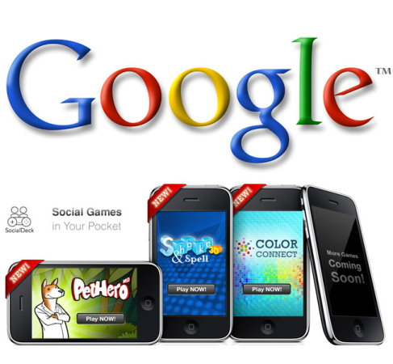

**[Google تسجل سادس عملية شراء لها خلال شهر بضمها socialDeck المتخصصة في الألعاب]( https://www.it-scoop.com/2010/09/google-socialdeck/)**

حطمت Google رقمها القياسي السابق المسجل في شهر أبريل و الذي كان شراءها لـ 5 شركات في شهر واحد، ليصل إلى 6 شركات في شهر أغسطس، و ذلك في سعيها لإطلاق شبكتها الاجتماعية Google Me.

فبعد شراء كل من [Slide](https://www.it-scoop.com/2010/08/google-slide/)، [jambool](https://www.it-scoop.com/2010/08/google-jambool-socia-gold/) ، [instantiations](http://www.instantiations.com/)، [Like.com](https://www.it-scoop.com/2010/08/google-like-com/)، [angstro](https://www.it-scoop.com/2010/08/google-angstro/) قامت Google بشراء شركة socialDeck المتخصصة هي أيضا في الألعاب و خاصة على هواتف الـ iPhone و الـ BlackBerry مقابل مبلغ لم يتم الكشف عنه.

الإعلان لم يتم على صفحات إحدى مدونات Google بعد، و إنما نجده على صفحة موقع socialDeck الرئيسية، و التي أشارت إلى ذلك قائلة:

<blockquote>أحد ما وجد ألعابنا ممتعة، و يتعلق الأمر بـ Google، socialDeck تم شراؤها و لقد انضممنا إلى فريق عمل Google.</blockquote>

الغريب في الأمر أن عدد شركة socialDeck لم تنتج سوى عدد قليل من الألعاب، لكن تشير بعض التحاليل إلى أن اهتمام Google ليس بهذه الألعاب في حد ذاتها و إنما بخبرة فريق العمل و الذي يقدم ألعابا متعددة المنصات كالـ iPhone و الـ BlackBerry و غيرهما.

الإعلان عن عملية الشراء على [موقع socialDeck](http://socialdeck.com/)
