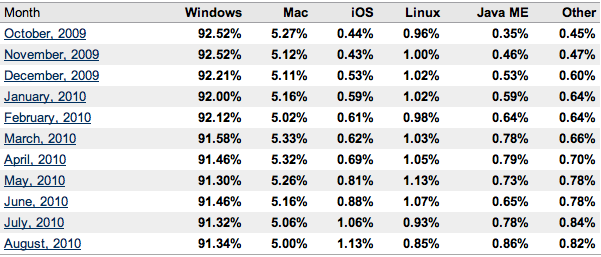

**[iOS يتجاوز Linux من حيث الاستعمال العالمي لأنظمة التشغيل](https://www.it-scoop.com/2010/09/net-applications-ios-passes-linux)**

نشرت Net Applications إحصائيات للاستعمال العالمي لأنظمة التشغيل و التي بينت أن نظام تشغيل iOS الذي يجهز هواتف iPhone و أجهزة iPad يتجاوز نظام Linux بكل توزيعاته من حيث الاستعمال العالمي.

و لقد حصل iOS على نسبة 1.13%  مقابل 0.85% لنظام Linux، في حين لم يسجل Android سوى 0.2%. أما Windows فحافظ على صدارته متجاوزا 91%.

إحصائيات Net Applications تأتي مخالفة تماما للإحصائيات [التي نشرتها Gartner](https://www.it-scoop.com/2010/08/gartner-mobile-device-second-quarter-2010/) سابقا حيث بينت Net Applications أنها تعتمد أساسا على مدى استعمال أنظمة التشغيل في الدخول إلى الإنترنت، في حين تعتمد Gartner على مبيعات الأجهزة المجهزة بأنظمة التشغيل التي تقيس مدى استعمالها.

و لقد بينت Gartner سابقا أن Android يحتل صدارة أنظمة تشغيل الهواتف متجاوزا iOS.

هل يتصل مستخدمو iOS بالإنترنت أكثر من نظرائهم مستخدمي Android و Linux؟ أم أنه لم تعد هناك أية مصداقية للأرقام التي تنشرها  مكاتب الدراسات المختلفة؟ ما رأيك؟

يمكن الإطلاع على إحصائيات Net Applications كاملة من [هنا](http://www.netmarketshare.com/operating-system-market-share.aspx?qprid=9&qpcustom=iOS,Linux&sample=36).
