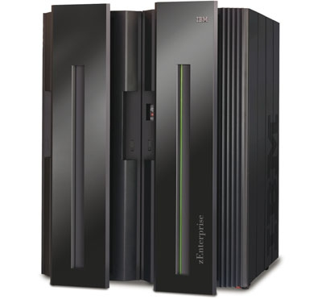

[**IBM تعلن عن z196 أسرع معالج في العالم بتردد 5.2 Ghz**](https://www.it-scoop.com/2010/09/ibm-z196-52-ghz/ )

كشفت IBM عن معالج z196 الذي يعتبر أسرع معالج على وجه المعمورة و الذي يصل تردده إلى 5.2 Ghz

المعالج الجديد سيكون حاضرا على أجهزة الـ mainframe التي تحمل اسم zEnterprise 196  و التي ستطلقها IBM في الـ 10 من سبتمبر القادم.

و لقد تمت صناعة المعالج باستعمال تقنية 45 nm  مما سمح باستعمال 1.4 مليار ترانزيستور على مساحة 512 ملم²، كل هذا كلف IBM ثلاث سنوات من العمل المتواصل و مليار و نصف مليار دولار.

تجدر الإشارة إلى أن الـ mainframe الجديد zEnterprise 196   يستعمل 96 معالج z196 و يستطيع القيام بـ 50 مليار عملية في الثانية.

يمكن قراءة المزيد حول الخبر من [هنا](http://www.zdnet.co.uk/news/servers/2010/09/03/ibm-prepares-to-ship-superfast-mainframe-40090002/)
