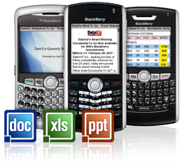

**[أنباء عن شراء RIM لـ Dataviz صاحبة حزمة التطبيقات Documents to Go](https://www.it-scoop.com/2010/09/rim-dataviz-documents-to-go/)**

أشارت العديد من المواقع المتخصصة في الـ BlackBerry عن شراء RIM لشركة Dataviz صاحبة حزمة التطبيقات Documents to Go.

حسب ما جاء على موقع [Crackberry](http://crackberry.com/dataviz-makers-documents-go-apparently-acquired-and-now-owned-research-motion) فإن قيمة الصفقة تحوم حول 50 مليون دولار و هو المبلغ الذي "لا يعتبر كبيرا" حتى تقوم RIM بالإعلان عن صفقة الشراء.

تطور Dataviz حزمة Documents to Go و التي تسمح بقراءة تطبيقات Word، Excel و PowerPoint الخاصة بحزمة Microsoft Office وملفات PDF على هواتف BlackBerry . كما أنها توفر نسخا لكل من iOS ، Android، Windows Mobile و Maemo.

و قد يكون شراء الشركة من طرف RIM السبب وراء [إعلان](http://www.dataviz.com/products/documentstogo/webos/technicalhurdles.html) Dataviz إيقاف العمل على الإصدار الخاص بنظام WebOS بعد  كان من المقرر إطلاقها.

بالرغم من عدم صدور أي بيان من قِبل RIM لتأكيد الشراء، إلا أن تحديث موظفي Dataviz لبياناتهم على شبكة LindekIn يؤكد ذلك.
