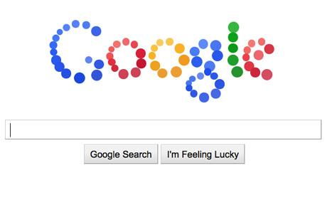

**[ما السر وراء الـ Doodle الجديد المتحرك لموقع Google؟](https://www.it-scoop.com/2010/09/google-doodle/)**

تقوم Google دوريا بتغيير شعارها على صفحة محرك بحثها الرئيسية للاحتفال بعيد معين أو للتنويه لحدث معين، و عادة ما يكون الشعار مرفقا بوصف سريع على هيئة Info Bull إضافة إلى صفحة بنتائج البحث عن ذلك الحدث و التي تظهر بمجرد النقر على الشعار.

الأمر مختلف اليوم ليس لكون الشعار متحركا ، فقد سبق لـ Google عمل أكثر من شعار مخصص (أو ما يطلق عليه مصطلح Doodle) متحرك كالـ Doodle الخاص باحتفال مرور ربع قرن عن الـ Buckyball ، و ليس بسبب تفاعليته، فقد سبق لـ Google الاحتفال بالـ [PacMan ](https://www.it-scoop.com/tag/pacman/)بتحويل شعارها إلى حلبة لهذه اللعبة الشهيرة، و لكن بسبب الغموض الذي يكتنفه.

و في [رد](http://www.telegraph.co.uk/technology/google/7986607/Google-logo-mystery-coloured-balls-interactive-doodle-celebrating-12th-birthday.html) على تساؤل لـ Daily Telegraph of London رد متحدث رسمي لـ Google بقوله:

<blockquote>سنترك الغموض متواصلا بشأن الـ Doodle</blockquote>

لكن لو أردنا تخمين المناسبة الخاصة التي تود Google الاحتفال بها لكانت الأقرب إلى الأذهان هو الاحتفال بمرور 12 عاما على تأسيس Google في الـ 07 من سبتمبر عام 1998. كما قد يكون الأمر متعلقا بخاصية جديدة ستكشف عنها Google لاحقا.

الفيديو التالية توضح مدى تفاعلية الشعار مع مؤشر الفأرة:

<!-- more -->

<object classid="clsid:d27cdb6e-ae6d-11cf-96b8-444553540000" width="640" codebase="http://download.macromedia.com/pub/shockwave/cabs/flash/swflash.cab#version=6,0,40,0" height="385"><embed src="http://www.youtube.com/v/NLGCaUsmUhc?fs=1&hl=fr_FR&rel=0" allowscriptaccess="always" height="385" width="640" allowfullscreen="true" type="application/x-shockwave-flash"></embed></object>

و أنت عزيزي القارئ؟ ما الحدث/الخاصية  التي تتوقع أنها خلف الـ Doodle الجديد لـ Google؟
