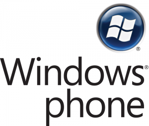

[**بشرى لمحبي لغة VB، أصبح بإمكانكم كتابة تطبيقات لـ Windows Phone 7 بلغتكم المفضلة**](https://www.it-scoop.com/2010/09/visual-basic-windows-phone-7/)

هل أنت من مبرمجي و محبي لغة Visual Basic ؟ هل كانت فكرة كتابة تطبيقات لـ Windows Phone 7 تدور في خلدك لكنك ألغيت الفكرة لعدم تمكنك من استعمال لغتك المفضلة؟ لا تقلقل فقد جاء الفرج :)  سيصبح بإمكانك القيام بذلك.

[
](https://www.it-scoop.com/wp-content/uploads/2010/09/windows-phone-7.png)

جاء الإعلان عن ذلك  على لسان (أو لنقل على لوحة مفاتيح :p  )  Brandon Watson في [تدوينة](http://www.windowsteamblog.com/windows_phone/b/wpdev/archive/2010/09/23/visual-basic-comes-to-windows-phone-7.aspx) على مدونة فريق عمل Windows، حيث جاء ضمن مجمل ما قال:

منذ إعلاننا عن Windows Phone 7  و مطورو لغة Visual Basic  يتساءلون متى سيصبح بإمكانهم كتابة تطبيقات للنظام الجديد ، لا مزيد من الحيرة بعد الآن.

-في رأيك هل تظن أن إتاحة كتابة تطبيقات لـ Windows Phone 7 للغة Visual Basic أمر إيجابي؟ علما أن أنظمة Microsoft الخاصة بالهواتف موجهة بشكل أكبر للشركات، و أن لغة Visual Basic عادة ما يقرن اسمها بالمبتدئين و الهواة ؟
