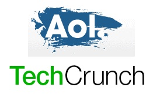

**[AOL تشتري مدونة TechCrunch](https://www.it-scoop.com/2010/09/aol-aquired-techcrunch/)**

بعد  Switched ،TUAW ،Endgadget ،DownloadSquad و 5min Media  ها هي AOL تعزز استحواذاتها بخصوص مواقع الأخبار التقنية بشرائها مدونة TechCrunch الشهيرة.

بدأت عام 2005، TechCrunch أصبحت وبسرعة كبيرة من أكثر المدونات المؤثرة في Silicon Valley. الشبكة تضم أيضا كل من مدونتي CrunchGear وMobileTech.

Tim Armstrong الرئيس التنفيذي لـ AOL صرح أن شركته كانت مهتمة بالموقع الأيام الأخيرة وذكر أن نشاطات TechCrunch ستبقى في San Francisco، وحسب بنود الاتفاق سيبقى الممول والمدون vedette Michael Arrington في عمله خلال الثلاث سنين القادمة.

- يجدر الإشارة إلى أن TechCrunch تستقطب حوالي مليوني زائر في الشهر.

تم الإعلان عن الاستحواذ البارحة في مدينة San Francisco في إطار مؤتمر Disrupt من تنظيم TechCrunch، ولم يتم بعد الإفصاح عن قيمة هذه الصفقة.

- يمكن الاطلاع على تفاصيل الاستحواذ على مدونة TechCrunch نفسها [من هنا](http://techcrunch.com/2010/09/28/tim-armstrong-we-got-techcrunch/). و[هذا تعليل Techcrunch](http://techcrunch.com/2010/09/28/why-we-sold-techcrunch-to-aol-and-where-we-go-from-here/) لسبب بيع نفسها لـ AOL.

- يا ترى إلى ما ترمي AOL بكل هذه الاستحواذات المتتالية المركزة على أخبار التقنية؟
