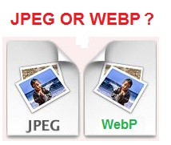

**[Google تطلق WebP، المعيار الجديد للصور على الويب](https://www.it-scoop.com/2010/10/google-webp/)**

بعد إطلاق وفتح** **النسق [WebM ](https://www.it-scoop.com/2010/05/google-webm-project/)الخاص بالفيديو، كشفت Goolge اليوم عن النسق الخاص بالصور WebP المنافس الجديد لـ JPEG.

حسب باحثين في Google ، فالنسق الجديد يمكنه اختزال حجم الصور المتبادلة عبر الأنترنت بنسبة 40 % بالمقارنة مع JPEG.

وحسب Richard Rabbat رئيس منتج "Make the web faster" لدى Google، تهيمن الصور على نسبة 65% من كمية نقل البيانات، وما نسبته 90% من هذه الصور هي نسق JPEG.

أما عن آلية عمل هذا المنتج الجديد "made in Google" :) فهو من النوع "المتلف" بعض الشيء، لكن لا يذهب ذهنك بعيدا، فهو يقوم بتخفيض حجم الصور عن طريق الضغط غير قابل لعملية عكسية (يعني لفك ضغط) بحذف تدرجي للمعلومات التي لا تدركها العين البشرية.

Google  تريد إقناع مصنعي المتصفحات لتضمين هذا النسق الجديد في برامجهم و -طبعا-  جعله قياسيا. ومن جهتها فالنسق WebP  سيتم تضمينه في Google Chrome الأسابيع القادمة (ربما النسخة السابعة؟) .

وفرت Google أداة تحويل تعمل من سطر الأوامر [يمكن تحميلها من هنا](http://code.google.com/intl/fr-FR/speed/webp/download.html).

كما وفرت أيضا معرضا[ للنسق الجديد WebP](http://code.google.com/intl/fr-FR/speed/webp/gallery.html).

يمكن الاطلاع على اعلان Google للنسق الجديد على [مدونة Chromium](http://blog.chromium.org/2010/09/webp-new-image-format-for-web.html).

- هل تعتقد أن النسق الجديد هذا سيُرحب به؟ أم أنه غير مجدي؟

-  هل سيخلع JPEG عن عرشه؟ وكم يحتاج لذلك؟
