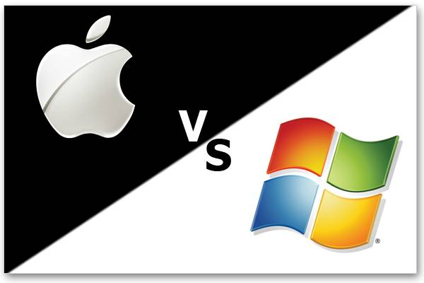

**[التفاحة المقضومة تقضم جزءً من حصة Windows في أوروبا](https://www.it-scoop.com/2010/10/windows-mac-os-x-os-market-share)**

كما يقول المثل:"من السهل الوصول إلى القمة لكن من الصعب أن تبقى فيها طويلا"، فبعد أن التهم حصة الأسد و حافظ عليها لمدة طويلة، بدأت أولى بوادر تراجع نظام Windows، فلقد أظهرت [دراسة](http://www.atinternet-institute.com/fr-fr/equipement-internaute/systemes-d-exploitation-aout-2010/index-1-1-7-211.html) لـ AT Internet Institute أن Windows سجل تراجعا طفيفا في أوروبا تاركا المجال لأنظمة Apple بالتقدم و ذلك خلال شهر أغسطس المنصرم.

و حسب هذه الدراسة فلقد تراجعت حصة Windows في أوروبا من 93.3% خلال شهر أغسطس من العام الماضي إلى 91.1% خلال نفس الفترة من العام الجاري، فيما تقدم نظراؤه لدى Apple (Mac OS X و iOS) من 5.4% إلى 7.4% خلال نفس الفترة.

و ضمن "فصيلة" Windows لا يزال Windows XP يحتل الصدارة 51.3% يتلوه  Vista بـ 20.7% و يتبعه Windows 7 بنسبة 17.5%.

أما Linux فلم يسجل إلا زيادة قدرت بـ 0.1% حيث بلغت حصته 0.9%.

هل يمكن أن تكون الدراسة "غير منصفة" بضمها iOS إلى Mac OS X ؟  قد يكون الأمر كذلك و قد يكون هذه التراجع راجعا إلى دخول أجهزة iPad إلى الساحة. لكن في رأيك إلى متى تتوقع أن تواصل أنظمة Windows هيمنتها على سوق أجهزة الحواسيب؟
