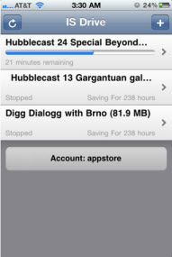

**[Apple تسمح بتطبيق Torrent على الـ AppStore](https://www.it-scoop.com/2010/10/is-drive-torrent-app-approved-on-appstore)**

لا ندري أهو تغير في سياسة Apple أم أنه مجرد خطأ عابر؟ لكن تطبيق IS DRIVE لتحميل ملفات Torrent تم الموافقة عليه [ولا يزال متوفرا على الـ AppStore.](http://itunes.apple.com/us/app/is-drive/id394341587?mt=8)

من المعروف أن سياسة Apple الصارمة ترفض أي تطبيق متعلق بتحميل ملفات Torrent، لكن تطبيق IS Drive جاء كأول استثناء لهذه القاعدة وهو يسمح بمستخدمي خدمة ImageShack بتحميل ملفات تورنت وتخزينها مباشرة على هواتفهم.

وحسب Torrent Freak فالمطور Derek Kepner تجنب تضمين كلمة "torrent" في برنامجه فكانت النتيجة أن التطبيق يمكن تحميله لحد الساعة، لكنه يعترف أنه على ساحة خطيرة، ويرى أن المستخدم هو الوحيد المسؤول عن نفسه وليس الأداة نفسها.

يمكن تحميل الأداة من على الـ AppStore [من هنا](http://itunes.apple.com/us/app/is-drive/id394341587?mt=8).

- وأنت عزيزي القارئ، هل تظنها مجرد غفلة من Apple وسيتم تداركها قريبا؟

- أم أنها بداية تغير إيجابي لسياسة التفاحة المقضومة؟
