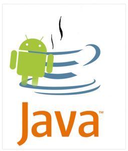

في محاولة للدفاع عن نفسها خلفت ردا مطولا [من  27 صفحة](http://www.scribd.com/doc/38765815/Google-Answer-and-Counterclaims-v-Oracle-Filed) ، تفاعلت  Google هذه المرة وبتفصيل أكثر  مع دعوى Oracle القضائية التي رُفعت عليها هذا الصيف ، رامية إياها بالنفاق مع لغة Java.

شهران من رفع الدعوى، استمرت فيها العلاقة بين عملاق الويب وOracle بالانحدار، حيث أُتهمت Google بانتهاك عدة براءات اختراع في نظام تشغلها مفتوح المصدر الموجه للهواتف Android.

Google  تنفي صراحة انتهاكها لأي براءة اختراع صالحة أو سارية المفعول لـ Oracle وتخلي مسؤوليتها من ذلك ، وأكدت أن نظامها حر ومفتوح المصدر حسب رخصة  Apache، لكنها هذه المرة تلوم على فعلة Oracle حين أغلقت أجزاء من لغة Java بحيث لا يمكن استغلالها في مشروع ذي رخصة حرة.

لكن لماذا رمتها بذي الوجهين؟ ، يشير موقع [The Register](http://www.theregister.co.uk/2010/10/06/google_answers_oracle_android_lawsuit/) بهذا الصدد إلى عام 2007، حين طلبت Oracle من شركة Sun Microsystems  فتح لغة Java  وجعلها حرة، لكنه تجلى وبوضوح أن هذا الاهتمام  مات مع شراء Sun عام 2009.

لأجل ذلك ظنت شركة Mountain View  بـ Oracle الظنونا،  وتعتقد أنها تلعب مع اللغة بأكثر من وجه، وعلى حسب قولها:

<blockquote>لقد تجاهلت Oracle نداءات مجتمع المصادر المفتوحة لفتح منصة Java  كليا</blockquote>

هكذا عللت Google نفاق Oracle الذي خدعها وخدع مستخدميها، وعلى هذا تعلق أملا على قاضي المحكمة ليتحسس هذه النقاط ويضع حدا لهذه الملاحقة.

وأتبعت Google أن برامجها لمنصة Android المكتوبة على لغة Java تعتمد على Dalvik bytecode هذا الأخير منفصل ومختلف تماما على Java bytecode، فالآلة الافتراضية Dalvik  لا تخص Java.

- يا ترى أين ستصل قضية هذان العملاقان المتناطحان؟

- وأنت عزيزي القارئ هل تظن أن Google تملك الحجة الدامغة ؟
