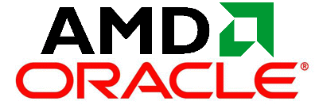

**[AMD: "لسنا للبيع و لكن... سنستمع لكل العروض المهمة "](https://www.it-scoop.com/2010/10/amd-oracle/)**

لا ندري هل هي مراودة لـ Oracle أو تمنع بطعم القبول، أو شيء من هذا القبيل، فلقد صرح Dirk Meyer المدير التنفيذي لـ AMD أن شركته ليست للبيع لكنهم يسعدهم أن يستمعوا إلى كل العروض التي تخدم مصلحة مساهميهم.

يأتي هذه [التصريح](http://www.reuters.com/article/idUSTRE69525920101006) أسبوعا بعد إبداء Larry Ellison  المدير العام لـ Oracle رغبته في ضم مصنع معالجات إلى أسطوله في القريب العاجل. ربما يأتي تصريح Meyer لرفع أسعار أسهم شركته قبل أن تقوم Oracle بـ"خطبتها" بشكل رسمي أو ربما هو قطع للطريق أمام شركات منافسة.

أمر واحد أكيد و هو أنه إن تقدمت Oracle رسميا "لطلب يد" AMD فإن المهر الذي ستدفعه سيكون كثير الأصفار، ترقبوا فمن المتوقع أن تكون فصول هذه الرواية مشوقة :).

-في رأيك، هل ستقدم Oracle على شراء AMD ؟
