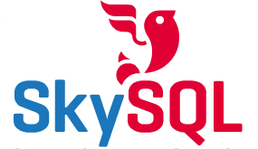

**[انطلاق SkySQL لتوفير دعم فني خاص بـ MySQL منافس لـ Oracle](https://www.it-scoop.com/2010/10/skysql/)**

بعد أن كثر الحديث عن مستقبل MySql المشكوك فيه بحكم سياسة Oracle المتشددة في كل ما لا يعود عليها بعائد مالي، قررت النواة الصلبة لمشروع MySQL و التي استقال أعضاؤها  قبل و أثناء عملية شراء Oracle لـ Sun الاجتماع من جديد لإطلاق شركة [SkySQL ](http://www.skysql.com/) التي ستكون مهمتها توفير الدعم الفني و الاستشارات للشركات الكبيرة التي تعتمد MySQL كنظام لإدارة قواعد بياناتها.

الاجتماع كان خلال عطلة نهاية الأسبوع المنصرمة في أحد فنادق اسطنبول التركية و لقد كانت نتيجته الإطلاق الفعلي لشركة SkySQL  AB  بقيادة Ulf Sandberg  و التي ستكون منافسا قويا لـ Oracle في مجال للدعم الفني و الاستشارات فيما يخص MySQL مما سيضمن لها مستقبلا بغض النظر عما ستقرره Oracle بشأنه إضافة إلى دعم MariaDB الـ Fork الذي نشأ من MySQL و يتولى مهمة الإشراف عليه Michael Widenius (Monty) مؤسس MySQL.

SkySQL ستنطلق بقوة بحكم سمعة أعضائها حيث أنها تتكون كلية من موظفين سابقين لدى MySQL إضافة لكونها مدعومة ماليا من طرف أكثر من مساهم و زبون.

بعد كل من MariaDB و SkySQL   يمكن القول (لكيلا نقول أنه يمكن الجزم) بأن مستقبل MySQL لم يعد مهددا ، حتى و إن قررت Oracle توقيفه هو أو دعمه الفني.

لزيارة موقع SKySQL:

[http://www.skysql.com/en/](http://www.skysql.com/en/)
