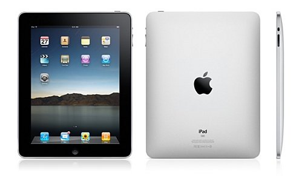

[**Gartner تنشر توقعات جد إيجابية لسوق الأجهزة اللوحية خلال السنوات القادمة**](https://www.it-scoop.com/2010/10/gartner-tablet/ )

نشر مكتب الدراسات Gartner [توقعاته ](http://www.gartner.com/it/page.jsp?id=1452614)لسوق الأجهزة اللوحية، أقل ما يقال عنها أنها إيجابية، حيث يتوقع أن تتضاعف مبيعات الأجهزة اللوحية بنسبة 181% خلال السنة القادمة.

و حسب Gartner فإن مبيعات الأجهزة اللوحية سيكون على النحو التالي:

19.5 مليون جهاز خلال 2010

54.7 مليون جهاز خلال 2011

103.4 مليون جهاز خلال 2012

154.1 مليون جهاز خلال 2013

208 مليون جهاز خلال 2014.

و تتوقع Gartner أن تلحق الأجهزة اللوحية  أضرارا بالغة في مبيعات كل من حواسيب NetBooks و القارئات الإلكترونية e-readers خاصة بعد أن تستقر أسعار الأجهزة اللوحية في حدود 300 دولار للجهاز . في حين تتوقع أن لا يتأثر سوق الأجهزة المكتبية المحمولة Laptop  و الهواتف الذكية SmartPhone بالأمر كون العلاقة التي ستكون بينها ستكون علاقية تكميلية و لن تكون استبدالية.

أما من حيث التوزيعية الجغرافية للمبيعات، فستحافظ الولايات المتحدة على حصة الأسد و التي تقدرها Gartner بـ 61% خلال هذا العام ، لكن الأمر لن يطول طويلا خلال السنوات القادمة حيث سينزل إلى غاية 43% سنة 2014.

كما أنه من المتوقع أيضا أن تفرض الأجهزة اللوحية نفسها في الشركات، ليس نتيجة لتغير توجهات الشركات إلى الأجهزة اللوحية، و إنما ستجد طريقها نحوها عبر مختلف الموظفين الذين سيعتمدون عليها تدريجيا في أعمالهم.
