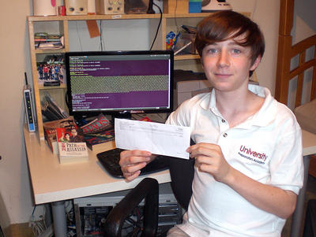

**[الأطفال أيضا يمكنهم اكتشاف ثغرات أمنية و الحصول على مكافآت نظيرها]( https://www.it-scoop.com/2010/10/boy-mozilla-firefox/ )**

بعد أن رفعت Mozilla قيمة مكافآتها نظير اكتشاف ثغرات أمنية على منتجاتها إلى 3000 دولار، أسالت لعاب الكثيرين، و لم يفلت من قبضة هذا الإغراء حتى الأطفال، فلقد تمكن صبي أمريكي لم يتجاوز الاثني عشر ربيعا من اكتشاف ثغرة بالغة الأهمية على متصفح Firefox و حصل بموجبها على صك يحمل الرقم 3 متبوعا بأصفار ثلاثة.

و حسب ما [كشفته](http://www.mercurynews.com/ci_16401891) صحيفة San Jose Mercury News الأمريكية، لم يكلف  الأمرُ الصبيَ Alex Miller سوى العمل لمدة ساعة و نصف يوميا لمدة عشرة أيام متتالية ليكتشف الثغرة (يعني 200 دولار للساعة :)).

كما أن الثغرة التي اكتشفها بالغة التعقيد ،و يتعلق الأمر بثغرة فيض للمكدس buffer overflow تمكن من توقيف المتصفح و النظام معا عن بعد، مما يتطلب بحثا و تمرسا كبيرين، و هما الأمران اللذان توفرا لدى Alex Miller رغم حداثة سنه.

هل سنسمع قريبا عن توظيف إحدى الشركات الكبرى لـ Alex Miller ؟ هذا ما سنكتشفه في الأيام القادمة.
