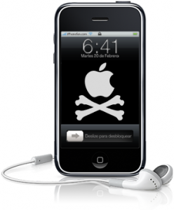

**[الكشف عن ثغرة في الـ iOS 4.1 تتيح تجاوز قفل الجهاز و إجراء مكالمات هاتفية](https://www.it-scoop.com/2010/10/iphone-ios-4-1-security-flaw/)**

إن كنت تستعمل iPhone و تظن أن هاتفك في منأى عن أيادي العابثين بسبب تفعيلك للحماية التي تتطلب إدخال كلمة سر معينة قبل استعمال هاتفك، فأدعوك إلى إعادة التفكير في الأمر، فلقد كشف أحد أعضاء [منتدى macRumors](http://forums.macrumors.com/showthread.php?t=1035879) عن ثغرة تتيح إجراء مكالمات هاتفية بالرغم من حماية الجهاز بكلمة سر.

الثغرة تخص نظام iOS 4.1 سواء تم عمل Jailbreak لها أم لم يتم ذلك، و تقوم على أساس استعمال خاصية "الاتصال الطارئ" المتاحة حتى لدى قفل الجهاز، و لدى تكوين أي رقم للاتصال به و بمجرد طلب الرقم (ظهور الزر الأحمر لقطع الاتصال) يكفي الضغط على زر Power  (الموجود في أعلى الجهاز) حتى يتحول النظام إلى وضع الاتصال الكامل.

لدى الوصول إلى هذا الوضع فإنه يصبح من الممكن إجراء مكالمات هاتفية، الوصول إلى البريد الالكتروني، و حتى ألبوم الصور.لكن الأمر لا يتعداه إلى باقي خواص النظام، حيث لا يمكن استعمال التطبيقات أو ما شابه.

سيحتوي التحديث القادم 4.2 لنظام iOS  ترقيعا لهذه الثغرة، حيث أن الإصدارات Beta الحالية للإصدار القادمة لا تشكو من نفس العلة.

الفيديو التالية توضح كيف تتم العملية:
