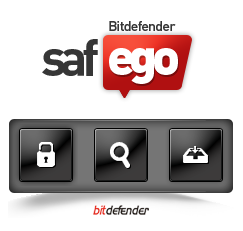
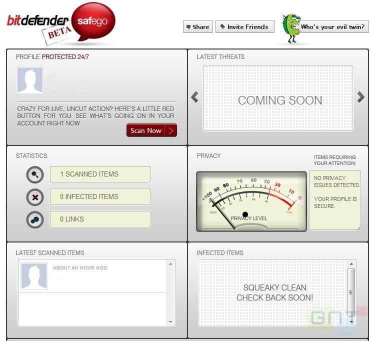

**تحديث :** BitDefender تطلق النسخة النهائية من تطبيق safego لحماية المستخدمين على Facebook

يمكن تنصيب التطبيق على Facebook مباشرة عبر [هذا الرابط](http://apps.facebook.com/bd-safego/),

و لمعرفة المزيد عنه يرجى الاطلاع على [البيان الصحفي](http://www.bitdefender.com/news/facebook-users-still-putting-their-friends-at-risk-2144.html) الخاص بالإصدار النهائي من التطبيق

**[BitDefender تطلق النسخة التجريبية من تطبيق safego](https://www.it-scoop.com/2010/11/bitdefender-safego)**

أعلنت BitDefender عن تطبيق جديد أطلقت عليه اسم safego لتوفير الحماية لمستخدميه على الشبكات الاجتماعية.

Safego في نسخته التجريبية الحالية يقتصر على شبكة Facebook فقط، و يتولى مهمة تحليل ما يتم نشره على حائط Wall المستخدم، رسائله الخاصة و التعليقات، و لهذا لاكتشاف أية  منشورات تمت من طرف تطبيقات ضارة و التي بدأت تعرف انتشارا متزايدا عبر الشبكات الاجتماعية.

و حسب البيان الصحفي الخاص بهذا التطبيق (و الذي تلقينا نسخة منه) ، يوفر تطبيق Safego الحماية لمستخدميه حتى و لو لم يكونوا متصلين، مما يجنب أصدقاء مستخدمي Safego أية مشاكل تنتج عن نشر البرامج الضارة أي روابط، صور أو فيديوهات على حوائطهم  من دون علمهم.

لمن أراد تجربة التطبيق فهو متوفر مباشرة على الـ Facebook من [هنا](http://apps.facebook.com/bd-safego/).

-هل سبق لك و أن استقبلت روابط أو شاهدت منشورات على حوائط أصدقائك تم نشرها من دون علمهم ؟

-هل تنوي استعمال تطبيق Safego على حسابك على الـ Facebook ؟
