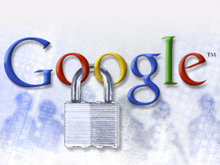

**[بعد Chrome، اكتشاف الثغرات على باقي تطبيقات Google يدر بدوره أموالا](https://www.it-scoop.com/2010/11/google-web-application-security)**

بعد أن أطلقت حملة  لمنح مكافآت لمكتشفي الثغرات على متصفح Chrome، قررت Google توسيع نطاق "سخائها" إلى أغلب تطبيقاتها على الويب.

التطبيقات المعنية حاليا هي كل خدماتها على الويب و ضربت Google الأمثلة التالية:

<blockquote>

> 
> 
	  * *.google.com
	  * *.youtube.com
	  * *.blogger.com
	  * *.orkut.com

</blockquote>

لكنها استثنت حاليا التطبيقات Client التي تستعمل خدماتها كـ Android، Picasa ، Google Desktop و غيرها.

أما عن الثغرات المعنية بالأمر، فلقد تركت Google الخيار مفتوح نسبيا، و خصت بالذكر ثغرات

<blockquote>

> 
> 
	  * XSS
	  * XSRF / CSRF
	  * XSSI (cross-site script      inclusion)

</blockquote>

إلى جانب الثغرات التي تسمح لمستخدم ما استخدام حساب و بيانات مستخدم آخر.

و ستخصص نفس المكافآت التي تمنح عادة لمكتشفي ثغرات Chrome و التي تقدر ما بين 500 و 3 133,7 دولار.
