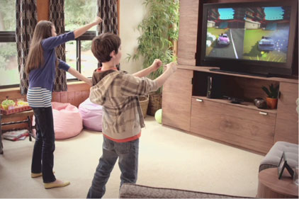
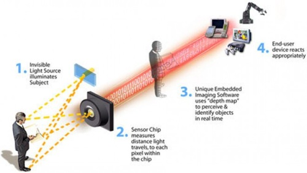

**[Microsoft Kinect لجهاز Xbox 360 يتعرض للقرصنة](https://www.it-scoop.com/2010/11/microsoft-kinect-xbox-360-hacked)**

[حدثناكم سابقاً](https://www.it-scoop.com/2010/06/microsoft-kinect-unveiled/) عن جهاز Kinect وعرضنا بعضاً من مزاياه والآن ننقل إليكم خبر تعرض جهاز Microsoft الجديد الموجّه لهواة الألعاب Microsoft Kinect motion-sensing game system والذي يضاف كـ Add-On على جهاز Xbox 360 – للاختراق والسيطرة عليه من قبل أحد القراصنة يدعى [AlexP](http://nuigroup.com/forums/viewthread/11154/) بعد بضع أيام فقط من إطلاق الجهاز للعموم.

الجهاز الذي يستخدم كجهاز استشعار للحركة (motion-sensing system) بشكل يستغني معه المرء عن مقابض التحكم التقليدية لأجهزة الألعاب يبلغ سعره 149 دولار أمريكي، ويكون بمقدورك من خلاله ممارسة ألعابك المفضلة "بنفسك" بشكل تحاول الصورة التالية توضيحه:

العملية تمت بعد قيام شركة Adafruit الصناعية بعرض مبلغ 1,000 2,000 [3,000 دولار أمريكي كجائزة](http://www.adafruit.com/blog/2010/11/08/the-bounty-is-now-3k-software-giant-says-engineers-linking-of-camera-based-system-to-windows-7-pc-does-not-constitute-hacking/) لمن يستطيع الحصول على شفرة مفتوحة المصدر – إن جاز التعبير – للجهاز.

الفكرة من قرصنة الجهاز والسيطرة عليه - بمعنى آخر -  استغلال إمكانياته القوية من حيث دقة الكاميرا وحساسية جهاز الاستشعار .. هو خدمة أهداف أخرى كصناعة الروبوتات وأجهزة المراقبة أو أغراض تعليمية ... أو حتى نقله للعمل على منصات ألعاب أخرى مثلاً، وربما أنظمة تشغيل أخرى ؟ :)

في تعقيب نشرته Adafruit على موقعها الرسمي تقول "بأن جهاز Kinect لأجهزة Xbox 360 لم تتم قرصنته – بأي شكل من الأشكال – حيث أن البرمجيات والعتاد الخاص به لم يتم التعديل عليها بأي شكل من الأشكال. كل ما حدث هو أن أحدهم قام بكتابة درايفرات تسمح لأجهزة أخرى بالتخاطب مع Kinect."

<!-- more -->

### **كيف يعمل الجهاز؟**

قامت مجلة Wired بكتابة مقال جيد جداً حول الجهاز وآلية عمله يمكن الإطلاع عليها من خلال [الرابط](http://www.wired.com/gadgetlab/2010/11/tonights-release-xbox-kinect-how-does-it-work/).

فيما يلي بعض مقاطع الفيديو التي نشرها AlexP والتي توضح كيف يقوم بالتحكم بالجهاز:

<object classid="clsid:d27cdb6e-ae6d-11cf-96b8-444553540000" width="425" codebase="http://download.macromedia.com/pub/shockwave/cabs/flash/swflash.cab#version=6,0,40,0" height="350"><embed width="425" src="http://www.youtube.com/v/DkODbZwGinQ&feature" type="application/x-shockwave-flash" height="350"> </embed></object>

<object classid="clsid:d27cdb6e-ae6d-11cf-96b8-444553540000" width="425" codebase="http://download.macromedia.com/pub/shockwave/cabs/flash/swflash.cab#version=6,0,40,0" height="350"><embed width="425" src="http://www.youtube.com/v/18vSblw5SNk&feature" type="application/x-shockwave-flash" height="350"></embed></object>

ما رأيك عزيزي القارئ ؟
