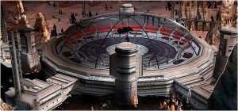
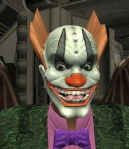

**[ملكية افتراضية تباع بـ  000 335 دولار !](https://www.it-scoop.com/2010/11/virtual-property-sold-with-3350000-dollars-in-a-mmorpg-game)**

[أعلنت](http://www.entropiaplanets.com/forums/entropia-news/3739-asteroid-goes.html) Nasa أقصد Neverdie -الوكالة العالمية للملاحة الفضائية واللعب!- أنها تمكنت من عقد صفقة ناجحة!،.. نعم، ……فقد استطاعت بيع كويكب بـ 335 000 دولار ! فقط؟ ...... افتراضي !، إثر صفقة دارت مؤخرا بين لاعبين في Calypso Planet في لعبة من نوع [MMORPG](http://en.wikipedia.org/wiki/Massively_multiplayer_online_role-playing_game) التابعة لمنصة ألعاب [Entropia Universe](http://www.entropiauniverse.com/).

لم تفهم شيئا؟ ذلك لأنه خبر مجنون قد أصاب جنونه كلماته:)، يتعلق بلعبة Entropia Universe التي تعد من ألعاب تقمص الأدوار كثيفة اللاعبين Massively multiplayer ذوات اقتصاد مضمن في اللعبة ingame له علاقة بالاقتصاد الحقيقي، وهذا يعني أن الرصيد الذي يملكه اللاعب في اللعبة يمكن تحويله إلى رصيد حقيقي على شاكلة ما هو مقترح في العالم الافتراضي للعبة Second Life الشهيرة.

وفي كوكب Calypso – في اللعبة- 10 PED هي العملة المحلية المعمول بها، ويقابلها 1 دولار في العالم الحقيقي، و بما قيمته 3 350 000 PED ابتاع المكنى بـ Jon Jacobs من آخر هو John Foma Kalun مركبا فضائيا مشيدا على كويكب !  يحتوي على عمارات، مركز تجاري و أماكن ترفيه موجهة لرواد هذه اللعبة :D . حيث ترتكز هذه اللعبة بشكل كبير على الاقتصاد أين يمكن بيع، شراء وتأجير الأشياء والممتلكات والاستثمار فيها.

وهذا هو مالك الكويكب الجديد، وكما يبدو لنا جليا هو سعيد بصفقته:

ليست هذه أول مرة يحقق فيها Jon Jacobs المكنى بـ  Neverdie هكذا بيع، فقد تبين عام 2005 أنه باع كويكبا بقيمة 100 000 دولار، وحقق رقما قياسيا العام الفارط  حين باع لأحدهم محطة Crystal Palace بما قيمته 000 330  دولار، لكن صفقته الأخيرة هذه قد حطمت كل الأرقام:) .

لن نقول لكم : ما رأيك عزيزي القارئ؟ لأنه جنون لا يتناطح عليه كبشان:) ، لكن نرجو أن تكون البسمة ارتسمت على وجوهكم كما ارتسمت على اللاعب أعلاه ( بغض النظر عن حسن الوجه :D )
