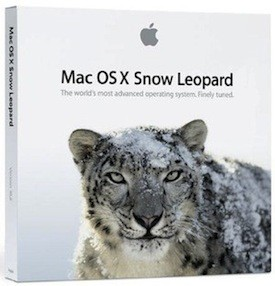

**[Apple تنشر التحديث 10.6.5 لنظام التشغيل Mac OS X](https://www.it-scoop.com/2010/11/apple-mac-os-x-10-6-5/)**

قامت Apple ليلة أمس بإطلاق التحديث 10.6.5  لنظام التشغيل الخاص بها Mac OS X و الذي يمكن الترقية له مباشرة عبر خدمة التحديث الخاصة بالنظام، أو بتحميل التحديث و تنفيذه.

ركز هذا التحديث بشكل أساسي على ثبات النظام و ترقيع العلل التي عرفها الإصدار السابق، كما عرف بعض الترقيعات الأمنية، إلى  جانب تحسينات لكل من أداء النظام مع خوادم Microsoft Exchange ، تصحيح بعض العلل التي كانت موجودة مع بعض طابعات HP و حل لمشكل كان يخص المسافات في خطوط OpenType.

التحديث متوفر للتحميل من على [هذه الصفحة](http://support.apple.com/kb/DL1324)، و تجدون قائمة بكامل ما جاء به هذا الإصدار على [هذه الصفحة](http://support.apple.com/kb/HT4250)
