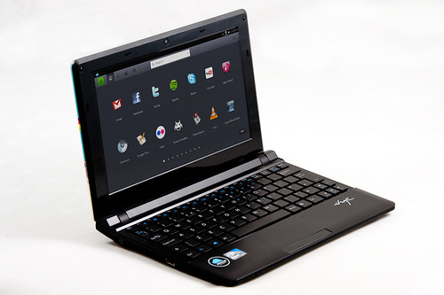

**[طارق كريم يعلن عن انطلاقة قريبه لجهاز JoliBook الخاص بنظام JoliCloud في المملكة المتحدة](https://www.it-scoop.com/2010/11/jolibook-jolicloud-netbook/)**

بعد أن كانت الأمور لا تزيد عن كونها "[إشاعات](https://www.it-scoop.com/2010/10/jolicloud-jolibook-netbook/)"، أكد طارق كريم عن وجود مشروع لجهاز Netbook خاص بنظام JoliCloud و الذي يطلق عليه اسم JoliBook و أعلن عن أول محطة له ستكون في المملكة المتحدة.

و في الحوار الذي أجراه معه موقع TechCrunch أشار طارق كريم إلى أن الجهاز سيكون بسعر في المتناول، لكن لم يحدد ذلك السعر، كما أنه لم يحدد تاريخ إطلاق الجهاز، لكن في المقابل يظهر في الفيديو كريم و هو يستعمل نظامه على جهاز MacBook Air. و لم يظهر في الفيديو سوى علبة الجهاز.

على صعيد آخر فلقد نشر مؤسس Netvibes  صورا لجهاز JoiCloud على حسابه على Flickr للاستعمال "على المدونات" كما أشار إليه في [تغريدة على حسابه على Twitter](http://twitter.com/tariqkrim/status/3094661862260738)، و هي التغريدة التي أرسلها باستعمال نظام Mac و هو ما يدفع للتساؤل إن كان فعلا يستعمل نظامه الخاص.

و إليكم الحوار كاملا:

<!-- more -->

