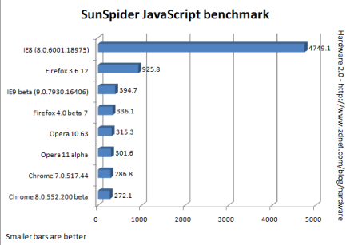

**[Mozilla تزيد من سرعة متصفحها Firefox 4 Beta 7، لكن Chrome و Opera لا يزالان في المقدمة](https://www.it-scoop.com/2010/11/mozilla-firefox-4-beta-7-faster)**

ما زالت حرب المتصفحات مستعرة حيث استطاعت Mozilla أن ترفع من قدرة متصفحها Firefox بإصداره 4 beta 7 فيما يخص محرك JavaScript، لكن المتصفح للأسف ما زال يحتاج للكثير حتى يستطيع اللحاق بمنافسيه Chrome و Opera.

يقدم Firefox 4 beta 7 العديد من التحسينات على الإصدار 3.6.12 ويظهر هذا واضحاً في اختبار القدرة SunSpider JavaScript benchmark والذي يظهر تحسناً في الأداء. لكن مع هذا ما يزال Firefox خلف Opera و Chrome في الترتيب.

يقول Adrian Kingsley صاحب المقالة الأصلية على موقع CNet الإخباري بأنه قام بوضع IE8 في اللائحة فقط للضحك :)

فيما يلي قائمة بنتائج أداء المتصفحات بالتفصيل:

	  * [Chrome 7.0.517.44](http://www2.webkit.org/perf/sunspider-0.9.1/sunspider-0.9.1/results.html?%7B%22v%22:%20%22sunspider-0.9.1%22,%20%223d-cube%22:%5B15,16,18,15,16,16,15,15,17,16%5D,%25)
	  * [IE8 (8.0.6001.18975)](http://www2.webkit.org/perf/sunspider-0.9.1/sunspider-0.9.1/results.html?%7B%22v%22:%20%22sunspider-0.9.1%22,%20%223d-cube%22:%5B187,187,187,187,188,188,187,187,190,187%5D,%223d-morph%22:%5B171,172,156,156,172,172,156,171,168,172%5D,%223d-raytrace%22:%5B234,249,249,234,250,250,234,249,261,258%5D,%22access-binary-trees%22:%5B172,171,171,156,171,171,172,172,185,178%5D,%22access-fannkuch%22:%5B343,359,343,343,343,343,343,359,349,350%5D,%22access-nbody%22:%5B219,219,218,218,218,218,219,218,220,218%5D,%22access-nsieve%22:%5B125,125,125,125,124,109,125,124,124,118%5D,%22bitops-3bit-bits-in-byte%22:%5B109,93,94,110,94,110,93,94,106,104%5D,%22bitops-bits-in-byte%22:%5B93,94,94,94,94,94,94,94,94,94%5D,%22bitops-bitwise-and%22:%5B296,297,296,297,297,297,297,297,296,294%5D,%22bitops-nsieve-bits%22:%5B156,156,156,141,156,141,141,141,150,150%5D,%22controlflow-recursive%22:%5B125,125,125,125,125,125,125,125,133,128%5D,%22crypto-aes%22:%5B156,156,156,156,156,156,156,156,163,152%5D,%22crypto-md5%22:%5B110,109,109,109,109,110,109,109,118,116%5D,%22crypto-sha1%22:%5B109,109,109,109,109,109,109,109,108,105%5D,%22date-format-tofte%22:%5B234,234,234,234,234,234,234,234,249,241%5D,%22date-format-xparb%22:%5B219,218,203,219,219,218,219,219,219,215%5D,%22math-cordic%22:%5B219,218,218,219,219,219,219,219,218,218%5D,%22math-partial-sums%22:%5B156,156,156,156,156,156,156,156,163,166%5D,%22math-spectral-norm%22:%5B156,156,156,156,156,156,156,156,158,158%5D,%22regexp-dna%22:%5B203,203,203,203,203,203,202,203,205,199%5D,%22string-base64%22:%5B156,156,156,156,171,156,156,171,169,165%5D,%22string-fasta%22:%5B266,265,265,266,265,265,265,265,265,260%5D,%22string-tagcloud%22:%5B172,172,171,187,171,171,172,171,179,176%5D,%22string-unpack-code%22:%5B188,187,187,187,187,187,187,171,183,190%5D,%22string-validate-input%22:%5B172,171,171,171,171,171,172,171,178,177%5D%7D)
	  * [Chrome 8.0.552.200 beta](http://www2.webkit.org/perf/sunspider-0.9.1/sunspider-0.9.1/results.html?%7B%22v%22:%20%22sunspider-0.9.1%22,%20%223d-cube%22:%5B17,16,15,16,16,16,16,16,16,16%5D,%223d-morph%22:%5B12,13,12,13,12,13,13,13,12,12%5D,%223d-raytrace%22:%5B14,13,14,13,13,13,13,13,14,13%5D,%22access-binary-trees%22:%5B0,2,1,2,2,1,2,2,2,1%5D,%22access-fannkuch%22:%5B14,14,13,13,13,13,14,13,13,14%5D,%22access-nbody%22:%5B13,12,13,13,13,13,13,13,13,12%5D,%22access-nsieve%22:%5B4,4,5,4,4,4,4,4,4,4%5D,%22bitops-3bit-bits-in-byte%22:%5B2,2,2,2,2,2,3,3,2,2%5D,%22bitops-bits-in-byte%22:%5B7,7,7,6,6,6,6,7,7,6%5D,%22bitops-bitwise-and%22:%5B8,8,9,8,9,8,8,8,9,8%5D,%22bitops-nsieve-bits%22:%5B9,8,9,9,9,9,8,8,9,9%5D,%22controlflow-recursive%22:%5B2,3,3,3,3,2,3,2,3,2%5D,%22crypto-aes%22:%5B7,8,8,7,7,8,7,8,7,7%5D,%22crypto-md5%22:%5B6,5,6,5,6,6,6,5,5,6%5D,%22crypto-sha1%22:%5B5,5,6,6,5,6,6,6,5,6%5D,%22date-format-tofte%22:%5B12,13,12,13,13,12,12,13,13,12%5D,%22date-format-xparb%22:%5B14,18,14,14,15,14,14,14,15,15%5D,%22math-cordic%22:%5B9,9,9,9,9,9,10,11,9,9%5D,%22math-partial-sums%22:%5B14,18,15,15,14,15,15,14,15,14%5D,%22math-spectral-norm%22:%5B5,6,5,5,5,4,5,4,5,5%5D,%22regexp-dna%22:%5B12,12,13,12,13,12,12,12,13,12%5D,%22string-base64%22:%5B5,5,6,5,5,5,5,5,6,6%5D,%22string-fasta%22:%5B13,16,14,13,14,13,14,13,14,14%5D,%22string-tagcloud%22:%5B23,23,23,23,23,23,23,24,23,23%5D,%22string-unpack-code%22:%5B28,30,29,30,29,30,29,29,29,29%5D,%22string-validate-input%22:%5B12,12,12,11,11,11,12,12,12,11%5D%7D)
	  * [Firefox 3.6.12](http://www2.webkit.org/perf/sunspider-0.9.1/sunspider-0.9.1/results.html?%7B%22v%22:%20%22sunspider-0.9.1%22,%20%223d-cube%22:%5B33,37,40,37,37,35,38,36,37,38%5D,%223d-morph%22:%5B44,44,44,45,44,45,44,44,46,47%5D,%223d-raytrace%22:%5B62,64,64,63,63,63,64,66,64,66%5D,%22access-binary-trees%22:%5B37,36,37,36,118,35,35,35,35,124%5D,%22access-fannkuch%22:%5B62,63,70,63,67,63,64,64,69,67%5D,%22access-nbody%22:%5B22,19,21,20,20,21,19,20,19,22%5D,%22access-nsieve%22:%5B11,11,11,11,11,10,10,11,11,17%5D,%22bitops-3bit-bits-in-byte%22:%5B1,1,1,1,2,2,1,2,1,2%5D,%22bitops-bits-in-byte%22:%5B9,10,9,9,9,9,9,8,9,10%5D,%22bitops-bitwise-and%22:%5B2,2,3,2,3,3,2,3,2,2%5D,%22bitops-nsieve-bits%22:%5B23,22,26,22,20,21,21,20,22,20%5D,%22controlflow-recursive%22:%5B40,40,50,40,41,40,40,41,40,41%5D,%22crypto-aes%22:%5B25,29,36,29,30,27,25,26,28,28%5D,%22crypto-md5%22:%5B13,20,14,11,12,11,11,12,12,13%5D,%22crypto-sha1%22:%5B7,7,10,9,7,8,7,6,7,7%5D,%22date-format-tofte%22:%5B74,74,78,77,79,70,75,79,76,83%5D,%22date-format-xparb%22:%5B71,71,73,73,72,72,71,74,72,74%5D,%22math-cordic%22:%5B29,27,27,28,27,28,27,28,28,28%5D,%22math-partial-sums%22:%5B14,15,15,14,14,14,14,14,15,14%5D,%22math-spectral-norm%22:%5B5,6,5,6,5,5,6,6,6,6%5D,%22regexp-dna%22:%5B34,34,35,74,33,34,34,34,92,34%5D,%22string-base64%22:%5B12,12,12,12,12,12,12,12,12,12%5D,%22string-fasta%22:%5B57,53,52,55,55,56,61,55,56,59%5D,%22string-tagcloud%22:%5B102,64,70,82,76,80,74,82,91,82%5D,%22string-unpack-code%22:%5B75,70,73,74,73,73,71,71,74,80%5D,%22string-validate-input%22:%5B56,26,55,51,43,43,33,43,46,47%5D%7D)
	  * [Firefox 4.0 beta 7](http://www2.webkit.org/perf/sunspider-0.9.1/sunspider-0.9.1/results.html?%7B%22v%22:%20%22sunspider-0.9.1%22,%20%223d-cube%22:%5B16,17,16,16,17,17,16,16,17,16%5D,%223d-morph%22:%5B9,9,9,9,10,10,9,10,9,9%5D,%223d-raytrace%22:%5B18,17,17,18,18,18,17,18,17,17%5D,%22access-binary-trees%22:%5B6,5,7,6,6,6,6,5,6,6%5D,%22access-fannkuch%22:%5B19,18,20,20,20,19,19,19,19,20%5D,%22access-nbody%22:%5B9,7,7,7,6,7,7,7,7,6%5D,%22access-nsieve%22:%5B8,7,9,8,8,7,8,8,7,7%5D,%22bitops-3bit-bits-in-byte%22:%5B1,0,1,0,1,0,1,1,1,0%5D,%22bitops-bits-in-byte%22:%5B10,8,10,8,9,7,8,8,8,8%5D,%22bitops-bitwise-and%22:%5B3,3,3,2,3,3,2,3,2,3%5D,%22bitops-nsieve-bits%22:%5B8,6,9,6,8,7,6,7,7,7%5D,%22controlflow-recursive%22:%5B4,2,3,3,3,3,3,3,3,3%5D,%22crypto-aes%22:%5B13,11,14,11,14,11,11,11,12,11%5D,%22crypto-md5%22:%5B6,6,62,4,6,4,5,5,5,4%5D,%22crypto-sha1%22:%5B4,5,4,4,5,4,4,4,4,3%5D,%22date-format-tofte%22:%5B28,28,22,80,27,22,23,23,27,23%5D,%22date-format-xparb%22:%5B38,36,31,31,37,29,29,29,37,29%5D,%22math-cordic%22:%5B10,10,8,9,10,8,9,8,9,8%5D,%22math-partial-sums%22:%5B17,16,13,13,16,13,13,13,13,13%5D,%22math-spectral-norm%22:%5B7,7,5,5,8,5,5,5,7,5%5D,%22regexp-dna%22:%5B21,21,18,17,17,17,17,16,16,16%5D,%22string-base64%22:%5B7,8,6,6,6,6,6,5,6,5%5D,%22string-fasta%22:%5B20,20,16,16,16,16,17,16,16,16%5D,%22string-tagcloud%22:%5B35,28,29,28,28,28,28,27,28,28%5D,%22string-unpack-code%22:%5B36,29,30,29,28,28,29,29,29,34%5D,%22string-validate-input%22:%5B16,14,13,13,13,13,12,13,14,13%5D%7D)
	  * [Opera 10.63](http://www2.webkit.org/perf/sunspider-0.9.1/sunspider-0.9.1/results.html?%7B%22v%22:%20%22sunspider-0.9.1%22,%20%223d-cube%22:%5B13,13,12,12,13,15,13,12,13,12%5D,%223d-morph%22:%5B16,16,16,16,17,20,15,15,16,16%5D,%223d-raytrace%22:%5B13,14,14,13,13,17,13,13,14,13%5D,%22access-binary-trees%22:%5B3,4,3,3,3,2,4,3,3,3%5D,%22access-fannkuch%22:%5B18,18,18,18,19,18,17,18,18,18%5D,%22access-nbody%22:%5B11,11,11,12,11,11,11,11,11,11%5D,%22access-nsieve%22:%5B4,4,5,5,5,4,5,4,5,5%5D,%22bitops-3bit-bits-in-byte%22:%5B1,2,2,1,1,2,1,1,2,3%5D,%22bitops-bits-in-byte%22:%5B3,3,3,3,3,3,3,3,3,4%5D,%22bitops-bitwise-and%22:%5B2,2,3,2,2,2,2,1,1,2%5D,%22bitops-nsieve-bits%22:%5B8,8,10,8,9,8,8,8,8,10%5D,%22controlflow-recursive%22:%5B4,4,5,5,4,4,4,4,4,5%5D,%22crypto-aes%22:%5B13,11,13,13,11,11,11,11,11,13%5D,%22crypto-md5%22:%5B5,6,6,6,5,5,5,6,6,6%5D,%22crypto-sha1%22:%5B4,4,4,4,4,3,3,3,4,4%5D,%22date-format-tofte%22:%5B23,21,21,17,18,17,18,19,19,22%5D,%22date-format-xparb%22:%5B26,22,26,22,22,21,22,23,22,27%5D,%22math-cordic%22:%5B8,8,10,8,8,7,10,8,8,8%5D,%22math-partial-sums%22:%5B31,25,31,25,24,31,25,25,25,25%5D,%22math-spectral-norm%22:%5B6,5,6,5,5,5,4,5,5,5%5D,%22regexp-dna%22:%5B13,13,16,14,13,13,13,13,14,13%5D,%22string-base64%22:%5B11,11,10,11,10,10,10,10,11,11%5D,%22string-fasta%22:%5B19,18,19,19,18,17,17,17,17,18%5D,%22string-tagcloud%22:%5B28,28,29,30,28,29,29,28,29,28%5D,%22string-unpack-code%22:%5B20,21,21,22,20,21,21,20,21,20%5D,%22string-validate-input%22:%5B20,21,21,23,23,20,21,21,21,20%5D%7D)
	  * [Opera 11 Alpha](http://www2.webkit.org/perf/sunspider-0.9.1/sunspider-0.9.1/results.html?%7B%22v%22:%20%22sunspider-0.9.1%22,%20%223d-cube%22:%5B10,10,10,11,10,11,10,12,13,10%5D,%223d-morph%22:%5B16,16,16,15,15,16,20,15,19,15%5D,%223d-raytrace%22:%5B13,13,15,13,13,12,16,13,15,13%5D,%22access-binary-trees%22:%5B3,3,3,3,3,3,4,3,3,3%5D,%22access-fannkuch%22:%5B17,18,18,18,18,18,22,17,17,18%5D,%22access-nbody%22:%5B11,11,13,11,11,11,14,11,11,11%5D,%22access-nsieve%22:%5B5,5,6,5,4,4,6,4,4,5%5D,%22bitops-3bit-bits-in-byte%22:%5B1,1,2,2,1,1,2,1,2,2%5D,%22bitops-bits-in-byte%22:%5B3,3,4,3,3,3,4,3,3,3%5D,%22bitops-bitwise-and%22:%5B2,3,2,1,2,2,3,2,2,2%5D,%22bitops-nsieve-bits%22:%5B8,8,10,8,8,8,10,8,8,8%5D,%22controlflow-recursive%22:%5B4,4,4,4,3,4,4,3,3,4%5D,%22crypto-aes%22:%5B10,10,12,10,11,11,13,10,10,11%5D,%22crypto-md5%22:%5B4,4,5,4,4,4,4,4,4,4%5D,%22crypto-sha1%22:%5B4,3,4,4,3,4,3,3,4,3%5D,%22date-format-tofte%22:%5B15,14,15,15,18,15,14,14,15,18%5D,%22date-format-xparb%22:%5B21,21,21,21,26,21,22,21,21,26%5D,%22math-cordic%22:%5B7,8,8,8,8,7,8,8,9,10%5D,%22math-partial-sums%22:%5B24,25,24,25,30,25,24,25,24,25%5D,%22math-spectral-norm%22:%5B5,5,5,5,5,5,4,4,4,4%5D,%22regexp-dna%22:%5B13,13,13,14,13,13,13,13,13,13%5D,%22string-base64%22:%5B10,10,10,10,10,12,10,10,10,10%5D,%22string-fasta%22:%5B17,17,16,17,17,17,17,17,17,19%5D,%22string-tagcloud%22:%5B28,28,29,29,29,35,28,27,28,28%5D,%22string-unpack-code%22:%5B20,20,21,21,20,25,19,20,20,20%5D,%22string-validate-input%22:%5B21,20,21,20,27,23,20,19,20,20%5D%7D)
	  * [IE9 beta (9.0.7930.16406)](http://www2.webkit.org/perf/sunspider-0.9.1/sunspider-0.9.1/results.html?%7B%22v%22:%20%22sunspider-0.9.1%22,%20%223d-cube%22:%5B18,18,18,18,18,18,19,18,18,18%5D,%223d-morph%22:%5B26,26,24,26,25,25,25,25,25,25%5D,%223d-raytrace%22:%5B19,21,19,19,19,20,21,19,19,20%5D,%22access-binary-trees%22:%5B6,6,6,6,6,6,6,6,7,6%5D,%22access-fannkuch%22:%5B13,13,13,14,13,13,13,13,13,13%5D,%22access-nbody%22:%5B20,20,21,20,21,21,20,21,20,21%5D,%22access-nsieve%22:%5B4,3,3,3,3,3,3,3,3,3%5D,%22bitops-3bit-bits-in-byte%22:%5B2,2,13,2,0,2,2,2,13,13%5D,%22bitops-bits-in-byte%22:%5B6,6,6,6,6,6,6,6,6,6%5D,%22bitops-bitwise-and%22:%5B4,4,4,4,4,4,4,4,4,5%5D,%22bitops-nsieve-bits%22:%5B11,11,11,11,11,11,7,11,11,11%5D,%22controlflow-recursive%22:%5B3,3,3,3,3,3,3,3,3,3%5D,%22crypto-aes%22:%5B8,8,8,8,8,8,8,8,8,8%5D,%22crypto-md5%22:%5B7,6,6,7,6,6,7,7,7,6%5D,%22crypto-sha1%22:%5B7,8,7,7,7,7,7,7,7,7%5D,%22date-format-tofte%22:%5B26,25,26,25,26,26,26,26,26,26%5D,%22date-format-xparb%22:%5B24,25,24,24,25,25,25,24,24,25%5D,%22math-cordic%22:%5B1,1,1,1,1,1,1,1,1,1%5D,%22math-partial-sums%22:%5B23,23,23,22,22,23,22,23,23,22%5D,%22math-spectral-norm%22:%5B11,12,11,11,11,11,11,11,11,11%5D,%22regexp-dna%22:%5B25,25,25,25,25,25,25,25,25,25%5D,%22string-base64%22:%5B7,7,7,7,7,7,7,7,7,7%5D,%22string-fasta%22:%5B24,24,24,24,24,24,24,24,24,25%5D,%22string-tagcloud%22:%5B33,33,33,33,33,33,33,33,33,33%5D,%22string-unpack-code%22:%5B41,41,40,41,41,41,41,41,42,41%5D,%22string-validate-input%22:%5B23,23,24,24,23,24,23,24,23,24%5D%7D)

يمكن الإطلاع على المقالة الأصلية عبر زيارة [الرابط](http://www.zdnet.com/blog/hardware/firefox-4-beta-7-fast-but-chrome-and-opera-are-faster/10325?tag=nl.e539).
