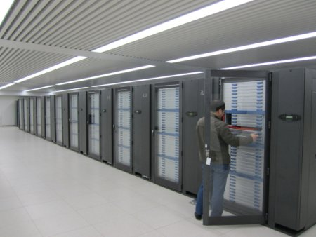
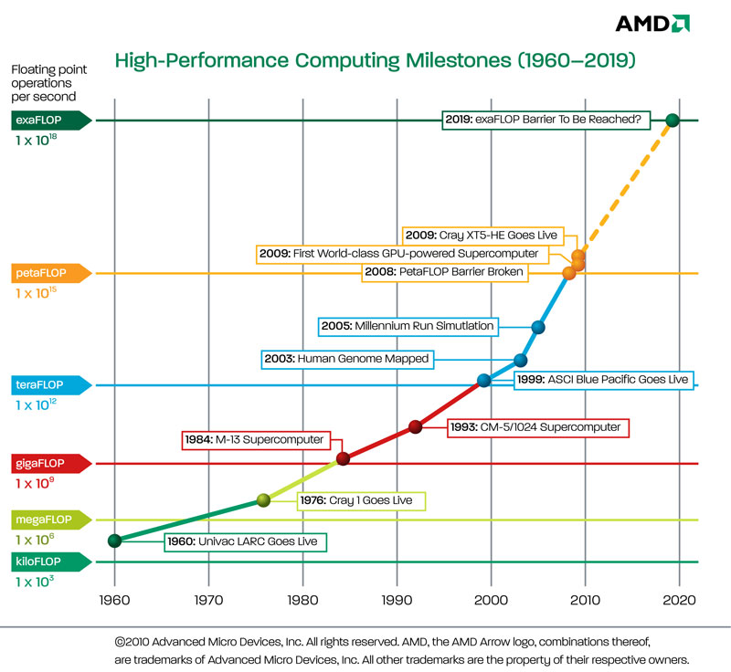

**[الصين تخطف رسميا المركز الأول في مجال الأجهزة العملاقة من يد الولايات المتحدة الأمريكية](https://www.it-scoop.com/2010/11/china-supercomputer-ranking/)**

يسقط الجاغوار أخيراً من قمة السلسلة الغذائية !

فعندما تم البارحة الإعلان عن قائمة أقوى أجهزة supercomputers حول العالم والتي تضم 500 متنافس ، سقط جهاز Cray XT5 – الملقب بـ "Jaguar" – إلى المرتبة الثانية، الجهاز الذي يتخذ من مختبرات Oak Ridge مقراً له والمستثمر من قبل جامعة تينيسي الأمريكية، وذلك بعد عام كامل من التهامه حصص باقي أجهزة supercomputers حول العالم حيث يترك مكانه لمنافسه Tianhe-1A المصنع من قبل جامعة الصين الوطنية للتكنولوجيا الدفاعية، والذي يتواجد في مركز أجهزة supercomputing الوطني في مدينة Tianjin الصينية.

حقق Tianhe-1A درجة أداء وصلت حتى 2.67 petaflop (الـ petaflop يساوي 1000 تريليون عملية فاصلة عائمة بالثانية) بينما حقق منافسه السابق "جاغوار" درجة أداء وصلت حتى 1.75 petaflop  وفي المرتبة الثالثة حلت الصين مرة أخرى مع جهازها Nebulae والذي حقق درجة أداء تساوي 1.27 petaflop.

لم تكن الأخبار المتعلقة بما أنجزته الصين في هذا المجال بمفاجئة، يقول البروفيسور Bill Gropp في جامعة الينويز لعلوم الكمبيوتر: "هذا ما توقعه الجميع. ما فعلته الصين هو أنها قامت باستغلال قوة معالجات GPU القريبة جداً من أن تكون الأنسب لهذا النوع من الاختبارات".

الاختبار الذي يتكلم عنه البروفيسور يدعى Linpack، والذي يقوم باختبار أداء الأجهزة من خلال حل Dense Linear Equations والتي تقاس بعدد عمليات الفاصلة العائمة المنفذة في الثانية الواحدة "flops".

"الطريقة التي ننظر بها إلى الجهاز الصيني، هو أنه جيد جداً في هذا المجال من العمليات (Linpack benchmark)، لكن ليس الأمثل للعمليات التي يبحث مجتمع المستثمرين عن حلول لها"، يعقب Bill.

لأولئك القلقين بأن ما حصل هو إطاحة لصدارة الولايات المتحدة الأمريكية في مجال الأجهزة العملاقة، فإن ما حصل ليس بالخطب الجلل على اعتبار أن الجهاز الصيني Tianhe-1A يعمل بنظام تشغيل لينوكس ومصنع باستخدام أجزاء من Intel و Nvidia، يشير البروفيسور Charlie Zender العامل في جامعة كاليفورنيا.

"لذا على الرغم من أننا نجد أنفسنا معجبين بالإنجاز الذي قامت به الصين، إلا أن هذا الإنجاز لم يكن ليتم لولا ما أخرجته Silicon Valley للعالم ... وبنظام تشغيل مصمم بشكل كبير بأيدي أشخاص من أمريكا وأوروبا" يقول Zender.

فيما يلي نعرض لمحة بسيطة عن تطور أنظمة supercomputers عبر السنوات الماضية:

<!-- more -->

للمهتمين بمجال الأجهزة العملاقة، ما الذي تتوقعه للسنوات القادمة في هذا المجال ؟

للمزيد من المعلومات حول الموضوع يمكن زيارة [الرابط](http://news.cnet.com/8301-31021_3-20022731-260.html).

و لمعرفة القائمة الكاملة لأسرع الحواسيب في العالم زوروا الموقع الرسمي للتصنيف من [هنا](http://www.top500.org/lists/2010/11)
