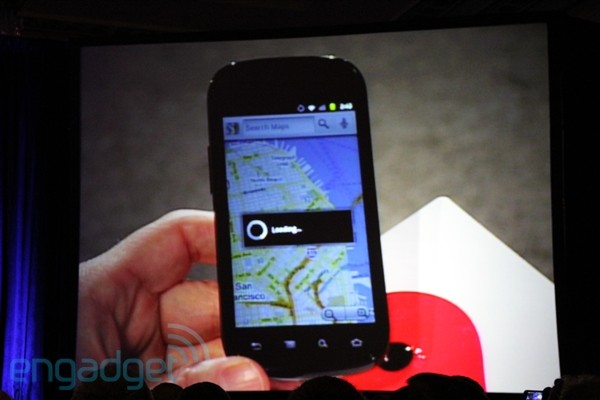

**[الكشف عن تصنيع Google Nexus S يقينا وليس إشاعة، وخبر الزنجبيل الأسابيع القادمة](https://www.it-scoop.com/2010/11/google-nexus-s-unveiled-by-eric-schmidt-and-android-2-3-gingerbread-will-be-available-in-next-weeks)**

يبدو أن البارحة كان يوما تقنيا مميزا عجيبا، لكل فيه شأن يغنيه، ومن ذلك ، ما صدم به Steve jobs  الكثيرين [بإعلانه المخيب](https://www.it-scoop.com/2010/11/apple-the-beatles-itunes/) بعد أن [توقع قراؤنا ](https://www.it-scoop.com/2010/11/apple-announcement/#section-comments)صدور نوع من iKabsh أو ما شابه:)، وفي حين [نحتفل بالعيد](https://www.it-scoop.com/2010/11/%d8%b5%d8%ad-%d8%b9%d9%8a%d8%af%d9%83%d9%85-2/) وأكل لحمه،  ينتظر الكثيرون من الجوعى خبر الزنجبيل متجهة أنظارهم نحو مخبزة Google؟ :D،  فبعد ما أحدثه موقع Engadget  من أخذ ورد [حين سرب صورا](http://www.engadget.com/2010/11/15/eric-schmidt-shows-off-a-nexus-s-at-the-web-2-0-summit/) لهاتف Google الجديد المزعوم، قطع البارحة  Eric Schimdt الرئيس التنفيذي لـ Google  الشك باليقين بشكل غير رسمي، إثر قمة مؤتمر Web 2.0 أين [صارح ](http://www.engadget.com/2010/11/15/eric-schmidt-shows-off-a-nexus-s-at-the-web-2-0-summit/)عن تصنيع  Google Nexus S  بالتعاون مع  Samsung مجهزا بـ Android 2.3 Gingerbread أو نظام Android تحت الاسم الكودي "خبز الزنجبيل".

عكس ما نفى بذلك الرئيس التنفيذي نفسه سابقا حين قال لا يوجد Nexus 2، يبدو أن Google  راجعت نفسها جيدا ورضخت لتصنيع هاتف ذكي آخر بالتعاون مع Samsung، وحسب القيل والقال، سيكون الهاتف مجهزا بمعالج بسرعة 1.2 GHz، وبكاميرا ومضية  بدقة 5 megapixels وبسعة تخزين محلية قدرها 16 Go، مجهزا بنظام  Android 2.3 Gingerbread  هذا الأخير الذي سيكون موعد صدوره الأسابيع القادمة كما أفاد بذلك Schimdt ومن أبرز ميزاته هو زرع تقنية NFC  وهي بروتوكول نقل بيانات مطور من قبل Nokia يهدف إلى تحويل الهاتف إلى نظام دفع إلكتروني.

- يا ترى كيف ستكون سياسية Google التسويقية هذه المرة بعد درس Nexus one القاسي؟

- وما سبب التخلي عن HTC والتحول إلى Samsung ؟ هل بسبب نجاح هذه الأخيرة مع هاتف Galaxy S المجهز هو أيضا بنظام Android ؟
