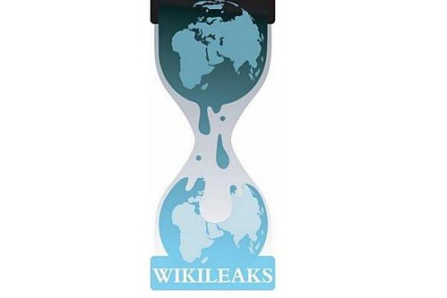

**[Amazon ترضخ للضغوط و توقف استضافتها لموقع Wikileaks]( https://www.it-scoop.com/2010/12/wikileaks-amazon-ec2/)**

بعد أسبوع من انتقال موقع Wikileaks إلى خدمة  EC2 الخاصة بـ Amazon لاستضافة ملفاته، رضخت هذه الأخيرة للضغوط السياسية و أوقفت استضافتها للموقع، مما اضطر بالموقع إلى الرجوع من جديد إلى القارة العجوز.

حاليا الموقع الرئيسي wikileaks.org يستخدم عنوان IP خاص بالمستضيف الفرنسي OVH أما الموقع الفرعي الذي أثار ضجة إعلامية مؤخرا فيحمل عنوان IP خاصا بالسويد.

و على [حساب Wikileaks على Twitter](http://twitter.com/wikileaks) نجد [التغريدة التالية](http://twitter.com/wikileaks/status/10058229002272768) التي يؤكد الموقع فيها "طرده" من خدمة Amazon و تحوله إلى أوروبا. أما [هذه التغريدة](http://twitter.com/wikileaks/status/10073870316863488) فيقول فيها: "لو أن Amazon لديها فعلا مشكل مع التعديل الأول (يقصد الدستور الأمريكي) فعليها التوقف عن بيع الكتب".

و يتعرض موقع  wikileaks إلى هجمات DDoS شرسة وصلت إلى غاية 10 GigaBits في الثانية، و تأتي بشكل أساسي من طرف Hackers أمريكيين مواليين لبلادهم، حيث أنه سبق لأحدهم و أن صرح أن هذا الموقع يعرض حياة الجنود الأمريكيين الموجود خارج الولايات المتحدة للخطر.

و عليه فإنه موقع wikileaks يمنع من الحديث في البلد الذي يعتبر نفسه حاميا لحرية الرأي و التعبير.

لمن فاتته الضجة الإعلامية التي أحدثها موقع Wikileaks الكاريكاتير التالي (بريشة أيوب من يومية [الخبر](http://www.elkhabar.com/ar) الجزائرية) توضح ذلك بشكل مختصر

http://www.elkhabar.com/ar/thumbnail.php?file=/Caricature_p28_463832052.jpg&size=article_large
