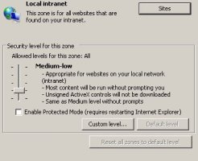

**[باحثون ينشرون طريقة لتجاوز الوضع المحمي في متصفح Internet Explorer](https://www.it-scoop.com/2010/12/bypass-protected-mode-internet-explorer)**

لنتذكر بعض الأحداث من التاريخ التقني سوياً.. وبدقة أكثر، لنتذكر معاً اللحظة التي قامت Microsoft بالإعلان عن توفير النمط المحمي Protected Mode في متصفحها Internet Explorer 7 على نظام التشغيل Windows Vista – الميزة المصممة لحماية أنظمة التشغيل Windows ضد الهجمات التي تحاول استغلال الثغرات في المتصفح أو في ملحقاته وتمنع حقن البرمجية الضارة في الذاكرة وتنفيذها.

حيث قام باحثون من Verizon Business [بشرح طريقة](http://www.verizonbusiness.com/resources/whitepapers/wp_escapingmicrosoftprotectedmodeinternetexplorer_en_xg.pdf) يمكن من خلالها تجاوز النمط المحمي في متصفح Internet Explorer 7 و 8 بهدف الحصول على صلاحيات مستخدم النظام.

تتطلب هذه الطريقة ثغرة تمكـّن المهاجم من تنفيذ كود برمجي في ذاكرة المتصفح أو في ذاكرة إحدى ملحقاته; وعلى الرغم من أن هذه البرمجية الخبيثة ستعمل فقط ضمن أدنى مستوى وثوقية من المتصفح، فإنها ستكون قادرة على تشغيل مخدم ويب على الجهاز والذي سيكون قادراً على استقبال وإجابة أي أمر على أي منفذ على واجهة loopback الشبكية. من خلال استدعاء الدالة IELauchURL() سيكون بإمكان المهاجم أن يأمر Internet Explorer أن يقوم بفتح رابط ما من خلال هذا المخدم، على سبيل المثال "http://localhost/exploit.html".

Localhost عموماً هي جزء من منطقة Intranet المحلية (Local Intranet Zone) وبشكل افتراضي، الوضع المحمي معطـّل من أجل المحتويات الخاصة بهذه المنطقة!

استغلال الثغرة للمرة الثانية في هذه الحالة سيمكن المهاجم من تنفيذ كود ضار في مستوى وثوقية متوسط (Medium Integrity level). سيكون بإمكان المهاجمين حينها الوصول إلى معلومات الحساب وتنصيب أي برنامج كان.

للوقاية من هذا النوع من الهجمات، ينصح الباحثون بأن يبقى عدد المواقع المضافة إلى قائمة Local Intranet Zone في الحد الأدنى وتفعيل الوضع المحمي لجميع المناطق.

[للمزيد حول الموضوع](http://threatpost.com/en_us/blogs/researchers-bypass-internet-explorer-protected-mode-120310)
