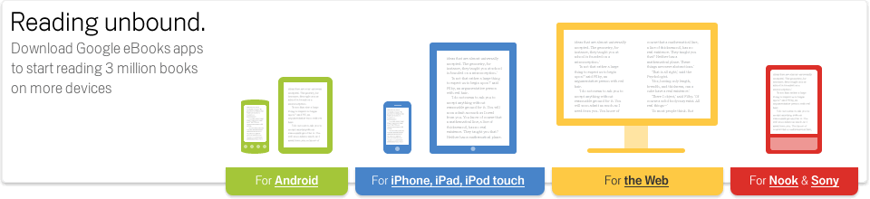

**[Google تطلق متجرها السحابيGoogle eBooks  لبيع الكتب الإلكترونية](https://www.it-scoop.com/2010/12/google-ebooks/)**

اليوم هو يوم Google بلا منازع، و نواصل مع خبر [إطلاق](http://books.google.com/help/ebooks/overview.html) Google لمتجرها السحابي [Google eBooks](http://books.google.com/ebooks) لبيع الكتب الالكترونية و تصفحها، و تصفح حتى الكتب المجانية.

ربما يقول قائل، كتب الكترونية+ بيع و قراءة، هذه فهمناها، لكن ما دخل الحوسبة السحابية هنا، الأمر بسيط، الكتاب لن تقوم بتنزيله على جهازك و إنما يبقى على حساب خاص بك و يمكنك قراءته من أي جهاز (حاسوب، هاتف، جهاز لوحي...) و يمكنك مواصلة القراءة من الصفحة التي توقفت فيها مهما كان الجهاز الذي كنت تستعمله حينها ، أو تستعمله لاحقا.

المكتبة توفر حاليا 3 ملايين كتاب من أصل 15 مليون كتاب تمت تصويرها سابقا و تخص ما لا يقل عن 35 ألف دار نشر و أزيد من 400 مكتبة.

الخدمة متوفر حاليا في الولايات المتحدة فقط، و سيتم تعميمها على باقي البلدان لاحقا.

الفيديو التالية توضح مبدأ عمل متجر Google الجديد لبيع الكتب Google eBooks :

<!-- more -->

<object classid="clsid:d27cdb6e-ae6d-11cf-96b8-444553540000" width="640" codebase="http://download.macromedia.com/pub/shockwave/cabs/flash/swflash.cab#version=6,0,40,0" height="385"><embed src="http://www.youtube.com/v/ZKEaypYJbb4?fs=1&hl=fr_FR&color1=0x5d1719&color2=0xcd311b" allowscriptaccess="always" height="385" width="640" allowfullscreen="true" type="application/x-shockwave-flash"></embed></object>
