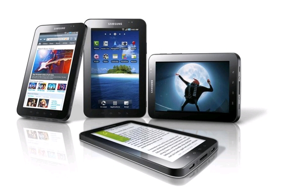

**[Samsung  تبيع مليون وحدة من Galaxy Tab  بعد شهرين فقط من إطلاقه](https://www.it-scoop.com/2010/12/galaxy-tab-sales-hit-1m-units/)**

هل كنت تعتقد أن جهاز الـ iPad لا يمكن مجاراته من حيث المبيعات والعتاد؟ ، حسنا، Samsung أسقطت ذلك، مع جهازها Samsung Galaxy Tab، حيث نجحت مؤخرا في تجاوز حاجز المليون وحدة بيعت فقط خلال شهرين من إطلاق الجهاز!، بل وتأمل بيع 1.5 مليون وحدة قبل نهاية هذا العام.

حسب ما [أشار إليه](http://www.computerworld.com/s/article/9199678/Update_Galaxy_Tab_sales_hit_1M_mark) موقع computerworld،  فيبدو أن الجهاز اللوحي الكوري ذي 7 إنشات، قد نجح في كسب جمهور غفير،  فقبل أسبوع مضى فقط ، تم بيع 600.000 وحدة حول العالم، ثم شهدت المبيعات ارتفاعا حادا خاصة في الولايات المتحدة نتيجة Thanksgiving holiday (أو عطلة تقديم الشكر!) ، وكذا توفره لدى 120 مزود خدمة الهاتف في 64 دولة.

وبمقارنة بسيطة مع جهاز الـ iPad فهذا الأخير بيع منه 2 مليون وحدة خلال شهرين، لكنه دخل في سوق خالية دون منافس، الأمر الذي لم يتوفر مع الـ Galaxy Tab، لكنه ومع ذلك حقق نجاحا باهرا، وأعلن المنافسة الحقيقية للـ iPad ، سواء من ناحية التصنيع والعتاد، المبيعات أو نظام التشغيل Android وكثرة تطبيقاته. وهذا يعتبر نجاحا مزدوجا لكل من Samsung و Google.

تجدر الإشارة إلى أن بعض التقارير تشير إلى أن Samsung تعمل على جهاز Galaxy Tab آخر بمقاس 10 إنشات، ومن المنتظر صدوره مع مطلع العام المقبل.

- هل تعتقد أن Galaxy Tab سيقضي على هيمنة الـiPad ؟ أم سيبقى هذا الأخير كذلك لبعض الوقت؟
