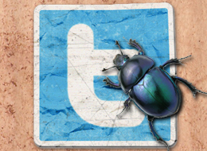
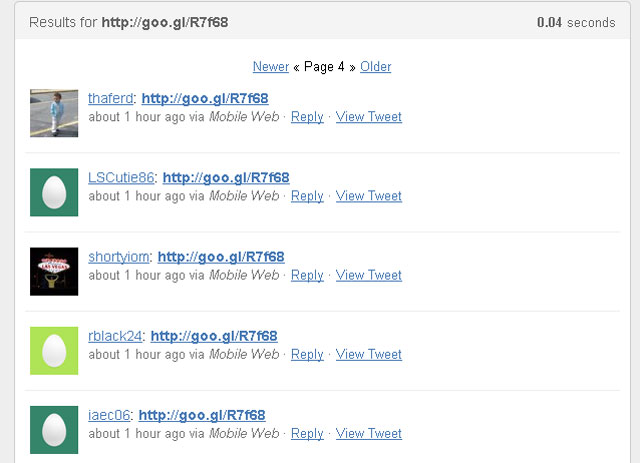

**[روابط Goo.gl خبيثة تنتشر على حسابات Twitter](https://www.it-scoop.com/2010/12/twitter-worm-goo-gl/)**

ظهر عدد كبير من الرسائل التي تحتوي على رابط عبر خدمة اختصار الروابط “goo.gl” والذي يأخذ الصيغة “goo.gl/R7f68” على Twitter أمس، حيث يقوم بتحويل المستخدمين إلى عدد من مواقع استضافة البرمجيات الخبيثة.

  

معظم الرسائل هذه وردت من حسابات قابلة للتخلي عنها (disposable accounts)، لكن قسم منها ظهر على [بعض الحسابات الحقيقية](https://search.twitter.com/search?q=http%3A%2F%2Fgoo.gl%2FR7f68)، والذي يشير إلى أن هناك دودة (worm) تنتشر وتقوم بإرسال هذه الرسائل من خلال الحسابات المصابة. بالإضافة إلى هذا، فإن جميع الرسائل التي تحتوي على هذا الرابط مصدرها [نسخة الموبايل من Twitter.](http://www.blippr.com/apps/336651-Twitter)  

[The Next Web](http://thenextweb.com/twitter/2010/12/07/new-twitter-worm-on-the-loose-watch-the-links-you-click/) قامت بتتبع مصادر الروابط في الرسائل، والتي تقوم بإرسال المستخدمين إلى موقع (hxxp://artcan-developpment.fr) الذي يبدو أنه تعرض للاختراق ليقوم بتحويل المستخدمين بدوره إلى العديد من المواقع التي تستضيف الكثير من البرمجيات الخبيثة.

في الوقت الذي تحتوي جميع هذه الرسائل على الرابط المختصر ذاته المذكور أعلاه، يجدر بنا التنويه إلى أن هذا الرابط غالباً سيتغير في المستقبل. وكما ننبه دائماً ، لا تقم بالضغط على أي رابط يشتبه به، وأبق نظامك محميا على الدوام ببرامج مكافحة الفيروسات والبرمجيات الخبيثة.

فيما يلي صورة للرسائل والروابط التي تحتويها:

  

  

[للمزيد من المعلومات](http://mashable.com/2010/12/07/twitter-worm-goo-gl/)  

