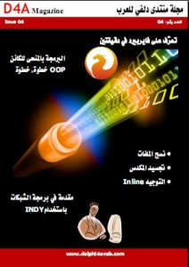

**[صدور العدد الرابع من مجلة منتدى دلفي للعرب](https://www.it-scoop.com/2010/12/delphi4arab-magazine-04/)**

بعد طول غياب تعود مجلة منتدى دلفي للعرب للصدور من جديد، بعدد رابع يحتوي العديد من المواضيع المهمة.

في طيات هذا العدد نجد كلا من:

<blockquote>افتتاحية: في هذا العدد
البرمجة بالمنحنى للكائن OOP خطوة، خطوة: الجزء الأول
أوامر دلفي: نسخ الملفات (بطرق مختلفة)
مكونات دلفي: مقدمة في برمجة الشبكات باستخدام INDY
أوامر دلفي: التوجيه Inline
أمثلة عملية بدلفي: تجسيد للمكدس Stack
قواعد البيانات: تعرف على فايربيرد في دقيقتين</blockquote>

العدد الرابع من مجلة منتدى دلفي للعرب متوفر للتحميل من [هنا](http://goo.gl/zDvh9)
